# PROYECTO EVALUACIÓN FINAL
## SEGURIDAD EN APLICACIONES WEB Y MÓVILES FULL STACK

**Estudiante:** David Hugo Rivas Gutierrez
**Módulo:** Seguridad en Aplicaciones Web y Móviles Full Stack
**Fecha:** Noviembre 2025
**Institución:** Universidad Catolica San Pablo

---

## TABLA DE CONTENIDOS

1. [Descripción del Sistema](#1-descripción-del-sistema)
2. [Tecnologías Utilizadas](#2-tecnologías-utilizadas)
3. [Checklist de Seguridad](#3-checklist-de-seguridad)
   - 3.1 [Gestión de Usuarios](#31-gestión-de-usuarios-a07-fallas-de-identificación)
   - 3.2 [Gestión de Contraseñas](#32-gestión-de-contraseñas-a07-fallas-de-autenticación)
   - 3.3 [Gestión de Roles](#33-gestión-de-roles-a01-pérdida-de-control-de-acceso)
   - 3.4 [Criptografía](#34-criptografía-a02-fallas-criptográficas)
   - 3.5 [Principios de Diseño y Desarrollo Seguro](#35-principios-de-diseño-y-desarrollo-seguro)
   - 3.6 [Checklist OWASP Top 10](#36-checklist-owasp-top-10)
4. [Enlaces y Recursos](#4-enlaces-y-recursos)

---

# 1. DESCRIPCIÓN DEL SISTEMA

## 1.1 Nombre del Sistema

**Munani** - Sistema de Gestión y Comercio Electrónico de Barritas Nutritivas

## 1.2 Objetivo del Sistema

El sistema Munani ha sido desarrollado como una aplicación móvil full stack destinada a la gestión integral de operaciones comerciales de barritas nutritivas. El objetivo principal del sistema es proporcionar una plataforma robusta y segura que permita la administración eficiente de inventarios, ventas, compras, transferencias entre ubicaciones, y la gestión de usuarios con diferentes niveles de acceso, todo ello implementando los más altos estándares de seguridad según las recomendaciones de OWASP (Open Web Application Security Project).

El sistema fue concebido bajo una arquitectura **offline-first**, permitiendo que los usuarios puedan continuar operando incluso sin conexión a Internet, sincronizando automáticamente los datos cuando la conectividad se restablece. Esta característica es fundamental para negocios minoristas que pueden experimentar interrupciones en la conectividad.

## 1.3 Módulos y Funcionalidades

El sistema Munani se compone de **13 módulos principales** (organizados como features en la arquitectura del proyecto), cada uno diseñado para cubrir aspectos específicos de la operación comercial. Algunos módulos incluyen sub-entidades relacionadas (por ejemplo, el módulo de Productos incluye Variantes, el módulo de Ubicaciones incluye Tiendas y Almacenes). A continuación se describe cada módulo implementado:

### **Módulo 1: Autenticación y Autorización**

El módulo de autenticación proporciona las funcionalidades de ingreso seguro al sistema, registro de nuevos usuarios clientes, recuperación de contraseña mediante correo electrónico, y gestión de sesiones con tokens JWT (JSON Web Tokens).

**Funcionalidades principales:**
- Login con email y contraseña
- Registro de clientes (customer signup)
- Recuperación de contraseña (forgot password) con enlace de restablecimiento
- Restablecimiento de contraseña (reset password) mediante tokens seguros
- Gestión automática de sesiones con refresh tokens
- Logout seguro con limpieza de sesión

**Capturas de funcionalidad:**

<div align="center">

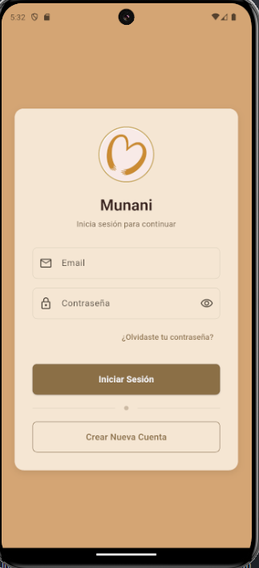

</div>

> Pantalla de login mostrando campos de email y contraseña con mensajes genéricos ante error.

<div align="center">

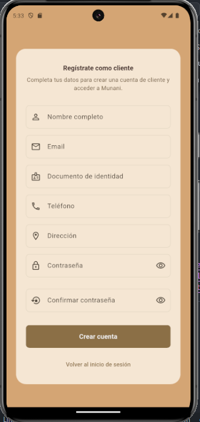

</div>

> Formulario de registro de clientes con campos adicionales y el indicador de fortaleza activo.


<div align="center">

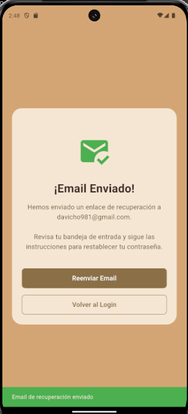

</div>

> Interfaz para solicitar enlace de restablecimiento de contraseña mediante email, con validación y sanitización de entrada.

### **Módulo 2: Productos**

Este módulo gestiona el catálogo completo de productos, incluyendo productos base y sus variantes (diferentes presentaciones, sabores, tamaños).

**Funcionalidades principales:**
- CRUD completo de productos (crear, leer, actualizar, eliminar)
- Gestión de variantes de productos con SKU único
- Categorización de productos (barritas nutritivas, proteicas, dietéticas, otros)
- Gestión de precios de venta y compra por variante
- Carga de imágenes múltiples por producto
- Búsqueda y filtrado por categoría

**Código relevante:**
```dart
// lib/features/products/domain/entities/product.dart
class Product {
  final String id;
  final String name;
  final String? description;
  final String category;
  final double basePriceSell;
  final double basePriceBuy;
  final bool hasVariants;
  final List<String> imageUrls;
  final String createdBy;
  final DateTime createdAt;
  final DateTime updatedAt;
}
```

<div align="center">

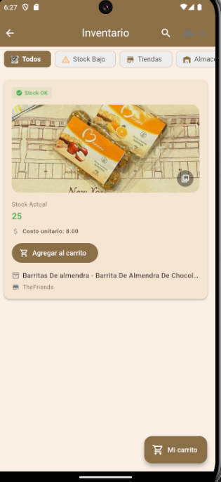

</div>

> Vista de catálogo con tarjetas de productos, imágenes, precios y acciones según permisos.

### **Módulo 3: Ubicaciones (Tiendas y Almacenes)**

Gestiona las ubicaciones físicas del negocio, diferenciando entre tiendas (puntos de venta) y almacenes (centros de almacenamiento).

**Funcionalidades principales:**
- CRUD de tiendas con información de dirección, teléfono y encargado
- CRUD de almacenes con información de dirección, teléfono y encargado
- Asignación de managers (encargados) por ubicación
- Gestión de códigos QR de pago por ubicación
- Activación/desactivación de ubicaciones

**Estructura de base de datos:**
```sql
-- Tabla: stores (Tiendas)
CREATE TABLE public.stores (
    id UUID PRIMARY KEY DEFAULT gen_random_uuid(),
    name TEXT NOT NULL UNIQUE,
    address TEXT NOT NULL,
    phone TEXT,
    payment_qr_url TEXT,
    payment_qr_description TEXT,
    manager_id UUID REFERENCES public.users(id),
    is_active BOOLEAN DEFAULT true,
    created_at TIMESTAMPTZ DEFAULT NOW(),
    updated_at TIMESTAMPTZ DEFAULT NOW()
);

-- Tabla: warehouses (Almacenes)
CREATE TABLE public.warehouses (
    id UUID PRIMARY KEY DEFAULT gen_random_uuid(),
    name TEXT NOT NULL UNIQUE,
    address TEXT NOT NULL,
    phone TEXT,
    payment_qr_url TEXT,
    payment_qr_description TEXT,
    manager_id UUID REFERENCES public.users(id),
    is_active BOOLEAN DEFAULT true,
    created_at TIMESTAMPTZ DEFAULT NOW(),
    updated_at TIMESTAMPTZ DEFAULT NOW()
);
```

### **Módulo 4: Inventario**

Control de stock de productos por ubicación (tienda o almacén), con gestión de cantidades, alertas de stock mínimo/máximo, y costos.

**Funcionalidades principales:**
- Visualización de inventario por ubicación
- Actualización de cantidades (ajustes de inventario)
- Alertas de stock mínimo (productos por agotarse)
- Gestión de costos unitarios y costos totales
- Historial de movimientos de inventario

**Estructura de base de datos:**
```sql
-- Tabla: inventory
CREATE TABLE public.inventory (
    id UUID PRIMARY KEY DEFAULT gen_random_uuid(),
    product_variant_id UUID NOT NULL REFERENCES public.product_variants(id),
    location_id UUID NOT NULL,
    location_type TEXT NOT NULL CHECK (location_type IN ('store', 'warehouse')),
    location_name TEXT,
    quantity INTEGER NOT NULL DEFAULT 0 CHECK (quantity >= 0),
    min_stock INTEGER NOT NULL DEFAULT 5,
    max_stock INTEGER NOT NULL DEFAULT 1000,
    unit_cost DECIMAL(10,2) NOT NULL DEFAULT 0.00,
    total_cost DECIMAL(12,2) NOT NULL DEFAULT 0.00,
    last_cost DECIMAL(10,2) NOT NULL DEFAULT 0.00,
    cost_updated_at TIMESTAMPTZ DEFAULT NOW(),
    image_urls TEXT[] DEFAULT ARRAY[]::TEXT[],
    last_updated TIMESTAMPTZ DEFAULT NOW(),
    updated_by UUID NOT NULL REFERENCES public.users(id)
);
```

<div align="center">

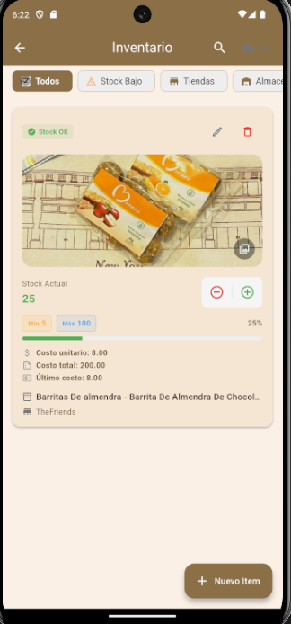

</div>

> Listado de inventario por ubicación con cantidades, stock mínimo/máximo y costos visibles.

### **Módulo 5: Transferencias**

Gestión de solicitudes de transferencia de productos entre ubicaciones (de almacén a tienda, o entre tiendas).

**Funcionalidades principales:**
- Creación de solicitudes de transferencia
- Aprobación/rechazo de transferencias (solo administradores)
- Seguimiento de estado (solicitado, aprobado, rechazado, completado)
- Actualización automática de inventario al completar transferencia
- Historial de transferencias por ubicación

### **Módulo 6: Compras y Proveedores**

Gestión integral del abastecimiento: desde la administración de proveedores hasta la creación y seguimiento de órdenes de compra para reponer inventario.

**Funcionalidades principales:**
- CRUD de proveedores (nombre, contacto, email, teléfono, dirección) y estado activo/inactivo.
- Historial de compras por proveedor con filtros y búsqueda.
- Creación de órdenes de compra con múltiples ítems.
- Selección del proveedor y ubicación de destino (tienda o almacén).
- Gestión de estados de compra (borrador, completada, cancelada).
- Recepción de compras con actualización automática de inventario y registro de costos por ítem.
- Reportes de compras por período y proveedor.

### **Módulo 7: Empleados**

Gestión de personal del negocio, diferenciando entre administradores, empleados de tienda, y empleados de almacén.

**Funcionalidades principales:**
- Registro de administradores
- Registro de empleados de tienda con asignación de ubicación
- Registro de empleados de almacén con asignación de ubicación
- Gestión de datos personales (CI, teléfono, dirección)
- Activación/desactivación de empleados

**Estructura de base de datos:**
```sql
-- Tabla: administrators
CREATE TABLE public.administrators (
    id UUID PRIMARY KEY REFERENCES auth.users(id),
    name TEXT NOT NULL,
    ci TEXT NOT NULL UNIQUE,
    phone TEXT,
    address TEXT,
    created_at TIMESTAMPTZ DEFAULT NOW()
);

-- Tabla: employees_store
CREATE TABLE public.employees_store (
    id UUID PRIMARY KEY REFERENCES auth.users(id),
    name TEXT NOT NULL,
    ci TEXT NOT NULL UNIQUE,
    store_id UUID REFERENCES public.stores(id),
    phone TEXT,
    address TEXT,
    created_at TIMESTAMPTZ DEFAULT NOW()
);

-- Tabla: employees_warehouse
CREATE TABLE public.employees_warehouse (
    id UUID PRIMARY KEY REFERENCES auth.users(id),
    name TEXT NOT NULL,
    ci TEXT NOT NULL UNIQUE,
    warehouse_id UUID REFERENCES public.warehouses(id),
    phone TEXT,
    address TEXT,
    created_at TIMESTAMPTZ DEFAULT NOW()
);
```

### **Módulo 8: Ventas**

Registro y gestión de ventas realizadas en tiendas, con soporte para múltiples items por venta y diferentes métodos de pago.

**Funcionalidades principales:**
- Registro de ventas con múltiples items
- Selección de cliente (opcional)
- Métodos de pago (efectivo, QR, tarjeta)
- Descuentos por venta
- Actualización automática de inventario
- Generación de comprobantes de venta
- Reportes de ventas por período

### **Módulo 9: Clientes**

Gestión de base de datos de clientes para ventas y fidelización.

**Funcionalidades principales:**
- CRUD de clientes (nombre, CI, teléfono, dirección)
- Asociación de clientes con usuario del sistema
- Historial de compras por cliente
- Filtrado por ubicación asignada

### **Módulo 10: Carrito de Compras**

Sistema de carrito de compras para clientes con gestión de pedidos y verificación de pagos mediante comprobantes.

**Funcionalidades principales:**
- Creación de carritos de compra por cliente
- Agregar/eliminar productos al carrito con validación de inventario
- Gestión de estados del carrito (pendiente, esperando pago, pago enviado, completado, cancelado)
- Carga de comprobantes de pago por parte del cliente
- Revisión y aprobación de comprobantes por administradores
- Conversión automática de carrito aprobado a venta
- Actualización automática de inventario al completar compra

**Estructura de base de datos:**
```sql
-- Tabla: carts (Carritos de compra)
CREATE TABLE public.carts (
    id UUID PRIMARY KEY DEFAULT gen_random_uuid(),
    customer_id UUID NOT NULL REFERENCES public.customers(id),
    status TEXT NOT NULL CHECK (status IN (
        'pending', 'awaiting_payment', 'payment_submitted',
        'payment_rejected', 'completed', 'cancelled'
    )),
    location_id UUID,
    location_type TEXT CHECK (location_type IN ('store', 'warehouse')),
    location_name TEXT,
    total_items INTEGER NOT NULL DEFAULT 0,
    subtotal NUMERIC(12,2) NOT NULL DEFAULT 0.00,
    created_at TIMESTAMPTZ DEFAULT NOW(),
    updated_at TIMESTAMPTZ DEFAULT NOW()
);

-- Tabla: cart_items (Items del carrito)
CREATE TABLE public.cart_items (
    id UUID PRIMARY KEY DEFAULT gen_random_uuid(),
    cart_id UUID NOT NULL REFERENCES public.carts(id) ON DELETE CASCADE,
    inventory_id UUID NOT NULL REFERENCES public.inventory(id),
    product_variant_id UUID NOT NULL REFERENCES public.product_variants(id),
    product_name TEXT,
    variant_name TEXT,
    image_urls TEXT[],
    quantity INTEGER NOT NULL CHECK (quantity > 0),
    available_quantity INTEGER NOT NULL,
    unit_price NUMERIC(12,2) NOT NULL,
    subtotal NUMERIC(12,2) NOT NULL,
    created_at TIMESTAMPTZ DEFAULT NOW()
);

-- Tabla: payment_receipts (Comprobantes de pago)
CREATE TABLE public.payment_receipts (
    id UUID PRIMARY KEY DEFAULT gen_random_uuid(),
    cart_id UUID NOT NULL REFERENCES public.carts(id) ON DELETE CASCADE,
    uploaded_by UUID NOT NULL REFERENCES public.customers(id),
    storage_path TEXT NOT NULL,
    status TEXT NOT NULL DEFAULT 'submitted' CHECK (
        status IN ('submitted', 'approved', 'rejected')
    ),
    notes TEXT,
    reviewed_by UUID REFERENCES public.users(id),
    reviewed_at TIMESTAMPTZ,
    created_at TIMESTAMPTZ DEFAULT NOW()
);
```

<div align="center">

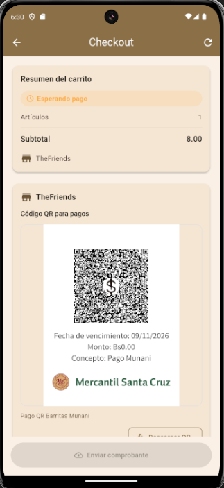

</div>

> Flujo completo del carrito mostrando productos, montos, carga de comprobante y estados del pedido.

### **Módulo 11: Usuarios del Sistema**

Administración centralizada de usuarios con roles y permisos (solo accesible por administradores).

**Funcionalidades principales:**
- Creación de usuarios con asignación de rol
- Edición de información de usuario (nombre, rol, ubicación asignada)
- Desactivación de usuarios (soft delete)
- Listado de usuarios con filtros
- Validación de contraseñas con política robusta

### **Módulo 12: Sincronización**

Sistema de sincronización bidireccional automática entre base de datos local (Isar) y remota (Supabase).

**Funcionalidades principales:**
- Sincronización automática cada 30 segundos
- Sincronización manual (pull-to-refresh)
- Cola de sincronización para operaciones pendientes
- Resolución de conflictos con timestamp
- Indicador visual de estado de sincronización
- Sincronización selectiva por rol (solo datos relevantes)

**Código relevante:**
```dart
// lib/core/services/auto_sync_service.dart
class AutoSyncService {
  Timer? _syncTimer;

  void startPeriodicSync() {
    _syncTimer = Timer.periodic(
      const Duration(seconds: 30),
      (_) => _performAutoSync(),
    );
  }

  Future<void> _performAutoSync() async {
    if (!await _connectivityService.hasConnection()) return;

    // Sincronizar solo datos relevantes según rol
    if (_userRole == 'admin') {
      await _syncAllData();
    } else if (_userRole == 'store_manager') {
      await _syncStoreData(_userId);
    } else if (_userRole == 'warehouse_manager') {
      await _syncWarehouseData(_userId);
    }
  }
}
```

### **Módulo 13: Reportes**

Generación de reportes analíticos de operaciones del negocio.

**Funcionalidades principales:**
- Reporte de ventas diarias
- Reporte de ventas por período
- Reporte de compras por período
- Reporte de transferencias
- Exportación a PDF/Excel
- Gráficos de tendencias

## 1.4 Arquitectura del Sistema

El sistema Munani ha sido desarrollado siguiendo los principios de **Clean Architecture** (Arquitectura Limpia) propuesta por Robert C. Martin, organizando el código en capas bien definidas con responsabilidades claras y dependencias unidireccionales.

### **Estructura de Capas**

```
┌─────────────────────────────────────────────┐
│         PRESENTATION LAYER                   │
│  (UI, BLoC, Pages, Widgets)                 │
│                                              │
│  - Pantallas (Pages)                        │
│  - Componentes (Widgets)                    │
│  - Gestión de estado (BLoC)                 │
└──────────────┬──────────────────────────────┘
               │
               ├──► Events (Eventos de usuario)
               │
               ▼
┌─────────────────────────────────────────────┐
│          DOMAIN LAYER                        │
│  (Entities, Use Cases, Repositories)        │
│                                              │
│  - Entidades de negocio (Entities)          │
│  - Casos de uso (Use Cases)                 │
│  - Contratos de repositorios (Interfaces)   │
└──────────────┬──────────────────────────────┘
               │
               ├──► Business Logic
               │
               ▼
┌─────────────────────────────────────────────┐
│           DATA LAYER                         │
│  (Repositories, Data Sources, Models)       │
│                                              │
│  - Implementación de repositorios           │
│  - Fuentes de datos (Local/Remote)          │
│  - Modelos de datos                         │
│  - Mappers (conversión de modelos)          │
└──────────────┬──────────────────────────────┘
               │
               ├──► Local (Isar)
               │
               └──► Remote (Supabase)
```

<div align="center">


</div>

> Representación visual de las tres capas del sistema con sus componentes y flujo de dependencias unidireccional.

### **Estructura de Carpetas del Proyecto**

El proyecto sigue una estructura modular organizada por features (características):

```
munani_app_v2/
├── lib/
│   ├── core/                          # Funcionalidades transversales
│   │   ├── config/                    # Configuraciones (Supabase, etc.)
│   │   ├── constants/                 # Constantes (colores, strings, rutas)
│   │   ├── di/                        # Dependency Injection (GetIt)
│   │   ├── errors/                    # Manejo de errores (Failures, Exceptions)
│   │   ├── network/                   # Cliente HTTP, interceptores
│   │   ├── services/                  # Servicios globales
│   │   │   ├── auto_sync_service.dart       # Sincronización automática
│   │   │   ├── connectivity_service.dart    # Estado de conectividad
│   │   │   ├── rate_limiter_service.dart    # Rate limiting (A07)
│   │   │   └── location_name_service.dart   # Resolución de nombres
│   │   ├── theme/                     # Tema de la aplicación
│   │   ├── utils/                     # Utilidades
│   │   │   ├── app_logger.dart              # Logging de seguridad (A09)
│   │   │   ├── input_sanitizer.dart         # Sanitización de inputs (A03)
│   │   │   ├── password_validator.dart      # Validación de contraseñas (A07)
│   │   │   ├── validators.dart              # Validadores generales
│   │   │   └── date_formatter.dart          # Formateo de fechas
│   │   └── widgets/                   # Widgets reutilizables
│   │       ├── custom_button.dart
│   │       ├── custom_text_field.dart
│   │       └── password_strength_indicator.dart  # Indicador de fortaleza
│   │
│   ├── features/                      # Módulos por feature
│   │   ├── auth/                      # Autenticación
│   │   │   ├── data/
│   │   │   │   ├── datasources/       # Local/Remote data sources
│   │   │   │   ├── models/            # Modelos de datos
│   │   │   │   └── repositories/      # Implementación de repositorios
│   │   │   ├── domain/
│   │   │   │   ├── entities/          # Entidad User
│   │   │   │   ├── repositories/      # Contratos de repositorio
│   │   │   │   └── usecases/          # Casos de uso (login, logout, etc.)
│   │   │   └── presentation/
│   │   │       ├── bloc/              # AuthBloc, AuthEvent, AuthState
│   │   │       ├── pages/             # Pantallas (login, signup, etc.)
│   │   │       └── widgets/           # Componentes específicos
│   │   │
│   │   ├── products/                  # Productos y variantes
│   │   ├── locations/                 # Tiendas y almacenes
│   │   ├── inventory/                 # Inventario
│   │   ├── transfers/                 # Transferencias
│   │   ├── purchases/                 # Compras y proveedores
│   │   ├── employees/                 # Empleados
│   │   ├── sales/                     # Ventas
│   │   ├── customers/                 # Clientes
│   │   ├── users/                     # Gestión de usuarios
│   │   ├── sync/                      # Sincronización
│   │   ├── cart/                      # Carrito de compras
│   │   └── reports/                   # Reportes
│   │
│   └── main.dart                      # Punto de entrada de la aplicación
│
├── sql/                               # Scripts de base de datos
│   ├── fase1/                         # Setup inicial (usuarios, auth)
│   │   ├── 00_run_all.sql
│   │   ├── 01_extensions.sql         # Extensiones (uuid-ossp, pgcrypto)
│   │   ├── 02_tables.sql             # Tabla users
│   │   ├── 03_indexes.sql            # Índices de performance
│   │   ├── 04_functions.sql          # Funciones helper (is_admin, etc.)
│   │   ├── 05_triggers.sql           # Trigger handle_new_user
│   │   ├── 06_rls_policies.sql       # Row Level Security
│   │   └── 07_setup_first_admin.sql  # Crear admin inicial
│   ├── fase2/                         # Productos, ubicaciones
│   ├── fase4/                         # Inventario
│   ├── fase5/                         # Transferencias
│   ├── fase6/                         # Compras y proveedores
│   ├── fase7/                         # Empleados
│   ├── fase8/                         # Ventas
│   ├── fase9/                         # Clientes
│   ├── fase10/                        # Carrito
│   └── fixes/                         # Scripts de corrección
│
├── assets/                            # Recursos estáticos
│   └── images/
│       └── munani.jpg                # Logo de la aplicación
│
├── docs/                              # Documentación
│   ├── evidencias/                   # Capturas de pantalla
│   ├── diagramas/                    # Diagramas UML, ER, flujos
│   └── videos/                       # Videos demostrativos
│
├── pubspec.yaml                      # Dependencias del proyecto
├── .env                              # Variables de entorno (no versionado)
├── README.md                         # Documentación principal
├── CHECKLIST_PENDIENTE_PROYECTO_FINAL.md
└── EF-DavidChoqueCalle.md           # Este documento
```

**Descripción de componentes clave:**

- **core/**: Contiene funcionalidades transversales como configuración, constantes, inyección de dependencias, manejo de errores, servicios globales, utilidades y widgets reutilizables.

- **features/**: Cada módulo del sistema está organizado como un "feature" independiente con su propia estructura de Clean Architecture (data, domain, presentation).

- **sql/**: Scripts SQL organizados por fases de desarrollo, cada fase implementa un conjunto de tablas, funciones, triggers y políticas RLS relacionadas.

- **Dependency Injection**: Utiliza GetIt para inyección de dependencias, configurado en `core/di/injection_container.dart`.

- **State Management**: Usa el patrón BLoC (Business Logic Component) para gestión de estado reactivo.

## 1.5 Diagrama de Base de Datos

El sistema utiliza PostgreSQL (via Supabase) como base de datos relacional principal, con las siguientes tablas implementadas:

### **Modelo Entidad-Relación**

```
┌──────────────────┐
│   auth.users     │ (Tabla de Supabase Auth)
│──────────────────│
│ id (UUID) PK     │
│ email            │
│ encrypted_pass   │──┐
│ ...              │  │
└──────────────────┘  │
                      │
                      │ 1:1
                      │
┌──────────────────┐  │
│  public.users    │◄─┘
│──────────────────│
│ id (UUID) PK/FK  │──┐
│ email            │  │
│ name             │  │
│ role             │  │ 1:N
│ assigned_loc_id  │  │
│ assigned_loc_type│  ├──────────────────────────┐
│ is_active        │  │                          │
│ created_at       │  │                          │
│ updated_at       │  │                          │
└──────────────────┘  │                          │
                      │                          │
        ┌─────────────┼──────────────┐           │
        │             │              │           │
        ▼             ▼              ▼           ▼
┌───────────────┐ ┌──────────────┐ ┌──────────────┐ ┌──────────────┐
│ administrators│ │employees_store│ │employees_wh  │ │  customers   │
│───────────────│ │──────────────│ │──────────────│ │──────────────│
│ id PK/FK      │ │ id PK/FK     │ │ id PK/FK     │ │ id PK        │
│ name          │ │ name         │ │ name         │ │ user_id FK   │
│ ci            │ │ ci           │ │ ci           │ │ name         │
│ phone         │ │ store_id FK  │ │ warehouse_id │ │ ci           │
│ address       │ │ phone        │ │ phone        │ │ phone        │
└───────────────┘ │ address      │ │ address      │ │ address      │
                  └──────────────┘ └──────────────┘ │ location_id  │
                                                     │ location_type│
                                                     └──────────────┘
┌────────────────┐         ┌────────────────┐
│    stores      │         │  warehouses    │
│────────────────│         │────────────────│
│ id (UUID) PK   │         │ id (UUID) PK   │
│ name           │         │ name           │
│ address        │         │ address        │
│ phone          │         │ phone          │
│ manager_id FK  │──┐      │ manager_id FK  │──┐
│ payment_qr_url │  │      │ payment_qr_url │  │
│ is_active      │  │      │ is_active      │  │
└────────────────┘  │      └────────────────┘  │
         │          │               │           │
         │          └───────────────┴───────────┘
         │                  (referencias a users.id)
         │
         │ location_id (polymorphic)
         │
         ▼
┌────────────────┐         ┌─────────────────┐         ┌──────────────────┐
│    products    │         │ product_variants│         │    inventory     │
│────────────────│  1:N    │─────────────────│  1:N    │──────────────────│
│ id PK          │◄────────│ id PK           │◄────────│ id PK            │
│ name           │         │ product_id FK   │         │ product_var_id FK│
│ description    │         │ sku (unique)    │         │ location_id      │
│ category       │         │ variant_name    │         │ location_type    │
│ base_price_sell│         │ variant_attrs   │         │ quantity         │
│ base_price_buy │         │ price_sell      │         │ min_stock        │
│ has_variants   │         │ price_buy       │         │ max_stock        │
│ image_urls[]   │         │ is_active       │         │ unit_cost        │
│ created_by FK  │         └─────────────────┘         │ updated_by FK    │
└────────────────┘                                      └──────────────────┘
         │                                                       │
         └───────────────────────────────────────────────────────┘
                            (audit fields)

┌─────────────────┐         ┌──────────────────┐
│    suppliers    │  1:N    │    purchases     │
│─────────────────│◄────────│──────────────────│
│ id PK           │         │ id PK            │
│ name            │         │ supplier_id FK   │
│ contact_person  │         │ location_id      │
│ email           │         │ location_type    │
│ phone           │         │ status           │
│ address         │         │ total_amount     │
└─────────────────┘         │ created_by FK    │
                            │ received_by FK   │
                            └──────────────────┘
                                     │ 1:N
                                     ▼
                            ┌──────────────────┐
                            │  purchase_items  │
                            │──────────────────│
                            │ id PK            │
                            │ purchase_id FK   │
                            │ product_var_id FK│
                            │ quantity         │
                            │ unit_price       │
                            │ subtotal         │
                            └──────────────────┘

┌────────────────┐         ┌─────────────────┐
│     sales      │  1:N    │   sale_items    │
│────────────────│◄────────│─────────────────│
│ id PK          │         │ id PK           │
│ customer_id FK │         │ sale_id FK      │
│ location_id    │         │ product_var_id  │
│ location_type  │         │ quantity        │
│ payment_method │         │ unit_price      │
│ total_amount   │         │ subtotal        │
│ discount       │         └─────────────────┘
│ created_by FK  │
└────────────────┘

┌────────────────┐         ┌─────────────────┐         ┌──────────────────┐
│     carts      │  1:N    │   cart_items    │         │ payment_receipts │
│────────────────│◄────────│─────────────────│         │──────────────────│
│ id PK          │         │ id PK           │   ┌────►│ id PK            │
│ customer_id FK │         │ cart_id FK      │   │     │ cart_id FK       │
│ status         │         │ inventory_id FK │   │     │ uploaded_by FK   │
│ location_id    │         │ product_var_id  │   │     │ storage_path     │
│ location_type  │         │ product_name    │   │     │ status           │
│ location_name  │         │ variant_name    │   │     │ notes            │
│ total_items    │         │ quantity        │   │     │ reviewed_by FK   │
│ subtotal       │         │ unit_price      │   │     │ reviewed_at      │
│ created_at     │         │ subtotal        │   │     └──────────────────┘
│ updated_at     │  1:N    └─────────────────┘   │
└────────────────┘─────────────────────────────────┘
         │
         └──────► references customers(id)

┌────────────────┐         ┌──────────────────┐
│   transfers    │  1:N    │ transfer_items   │
│────────────────│◄────────│──────────────────│
│ id PK          │         │ id PK            │
│ from_loc_id    │         │ transfer_id FK   │
│ from_loc_type  │         │ product_var_id FK│
│ to_loc_id      │         │ quantity         │
│ to_loc_type    │         └──────────────────┘
│ status         │
│ requested_by FK│
│ approved_by FK │
└────────────────┘

┌────────────────┐
│  sync_queue    │
│────────────────│
│ id PK          │
│ entity_type    │
│ entity_id      │
│ operation      │
│ status         │
│ created_at     │
└────────────────┘
```


### **Descripción de Tablas Principales**

**Tabla: `auth.users`**
- Tabla gestionada por Supabase Auth para almacenamiento de credenciales encriptadas con Argon2.

**Tabla: `public.users`**
- Almacena metadata de usuarios sincronizada con `auth.users` mediante trigger `handle_new_user`.
- Columnas clave: `role` (admin, store_manager, warehouse_manager, customer), `assigned_location_id`, `assigned_location_type`.

**Tabla: `products`**
- Catálogo de productos base con categorización, precios, imágenes y auditoría (`created_by`).

**Tabla: `product_variants`**
- Variantes de productos con SKU único, atributos JSON (color, tamaño), precios específicos.

**Tabla: `inventory`**
- Control de stock por ubicación con gestión de costos (FIFO/promedio ponderado) y auditoría (`updated_by`).

**Tabla: `stores` y `warehouses`**
- Ubicaciones físicas con manager asignado y códigos QR de pago.

**Tabla: `purchases` y `purchase_items`**
- Órdenes de compra con múltiples items, gestión de estados y recepción.

**Tabla: `sales` y `sale_items`**
- Registro de ventas con items, métodos de pago y descuentos.

**Tabla: `carts`, `cart_items` y `payment_receipts`**
- Sistema de carrito de compras para clientes con gestión de estados (pending, awaiting_payment, payment_submitted, completed, cancelled).
- `cart_items` contiene los productos seleccionados con snapshot de disponibilidad y precios.
- `payment_receipts` almacena comprobantes de pago cargados por clientes para revisión y aprobación por administradores.

**Tabla: `transfers` y `transfer_items`**
- Solicitudes de transferencia entre ubicaciones con aprobación y seguimiento de estado.

**Tabla: `sync_queue`**
- Cola de sincronización para operaciones offline pendientes.

---

# 2. TECNOLOGÍAS UTILIZADAS

## 2.1 Stack Tecnológico

El sistema Munani ha sido desarrollado utilizando un stack tecnológico moderno y robusto, seleccionado cuidadosamente para garantizar performance, escalabilidad y seguridad. A continuación se detallan las tecnologías implementadas:

### **Frontend (Aplicación Móvil)**

**Flutter 3.5.0+**
- Framework de Google para desarrollo multiplataforma (Android/iOS/Web/Desktop)
- Lenguaje: Dart 3.9.0
- Renderizado de alta performance con Skia engine
- Hot reload para desarrollo ágil
- Compilación nativa (ARM/x64)

**Justificación de elección:**
Flutter fue seleccionado por su capacidad de generar aplicaciones nativas de alta calidad desde una única base de código, reduciendo costos de desarrollo y mantenimiento. Su ecosistema maduro de paquetes y su rendimiento cercano al nativo lo convierten en la opción ideal para aplicaciones empresariales.

### **Gestión de Estado**

**flutter_bloc: 8.1.6**
- Implementación del patrón BLoC (Business Logic Component)
- Separación clara entre lógica de negocio y UI
- Testeable y mantenible
- Reactive programming con Streams

```dart
// Ejemplo de estructura BLoC
class ProductBloc extends Bloc<ProductEvent, ProductState> {
  ProductBloc({required this.getAllProducts}) : super(ProductInitial()) {
    on<LoadProducts>(_onLoadProducts);
    on<CreateProduct>(_onCreateProduct);
  }

  Future<void> _onLoadProducts(
    LoadProducts event,
    Emitter<ProductState> emit,
  ) async {
    emit(ProductLoading());
    final result = await getAllProducts();
    result.fold(
      (failure) => emit(ProductError(failure.message)),
      (products) => emit(ProductLoaded(products)),
    );
  }
}
```

### **Base de Datos Local (Offline)**

**Isar 3.1.0+1**
- Base de datos NoSQL embebida de alto rendimiento
- Diseñada específicamente para Flutter/Dart
- Queries extremadamente rápidas (10x más rápido que Hive)
- Soporte de índices compuestos
- Transacciones ACID
- Encryption nativa

**Características de seguridad:**
- Encriptación AES-256 para datos sensibles
- Queries parametrizadas (prevención de inyección)
- Aislamiento de datos por usuario

```dart
// Ejemplo de esquema Isar
@collection
class ProductLocalModel {
  Id id = Isar.autoIncrement;

  @Index(unique: true)
  String? remoteId;

  String name;
  String category;
  double basePriceSell;

  @Index()
  DateTime createdAt;
}
```

### **Backend y Servicios en la Nube**

**Supabase (PostgreSQL 15)**
- Backend as a Service (BaaS) basado en PostgreSQL
- Autenticación con Supabase Auth (Argon2 password hashing)
- Row Level Security (RLS) nativo de PostgreSQL
- RESTful API auto-generada
- Realtime subscriptions vía WebSockets
- Storage para archivos (imágenes, QR codes)

**Características de seguridad implementadas:**
- TLS 1.3 para todas las comunicaciones
- JWT (JSON Web Tokens) con firma HMAC-SHA256
- Refresh tokens con rotación automática
- Row Level Security en todas las tablas
- Funciones helper para validación de permisos (is_admin, is_store_manager, is_warehouse_manager)

```sql
-- Ejemplo de política RLS
CREATE POLICY "Admins can view all users"
ON public.users
FOR SELECT
USING (public.is_admin());

CREATE POLICY "Users can view own profile"
ON public.users
FOR SELECT
USING (id = auth.uid());
```

### **Networking y Conectividad**

**dio: 5.7.0**
- Cliente HTTP para Dart con interceptores
- Manejo de timeouts y reintentos
- Cancelación de requests
- Logging de requests/responses

**connectivity_plus: 6.0.5**
- Monitoreo de estado de conectividad
- Detección de cambios de red
- Soporte para WiFi, móvil, Ethernet

```dart
// Servicio de conectividad
class ConnectivityService {
  Stream<bool> get onConnectivityChanged {
    return Connectivity().onConnectivityChanged.map((result) {
      return result != ConnectivityResult.none;
    });
  }

  Future<bool> hasConnection() async {
    final result = await Connectivity().checkConnectivity();
    return result != ConnectivityResult.none;
  }
}
```

### **Inyección de Dependencias**

**get_it: 8.0.0**
- Service Locator para inyección de dependencias
- Singleton y Factory patterns
- Lazy loading de dependencias

```dart
// Configuración de DI
final sl = GetIt.instance;

Future<void> init() async {
  // BLoCs
  sl.registerFactory(() => AuthBloc(
    loginUseCase: sl(),
    logoutUseCase: sl(),
    getCurrentUserUseCase: sl(),
  ));

  // Use Cases
  sl.registerLazySingleton(() => LoginUseCase(sl()));

  // Repositories
  sl.registerLazySingleton<AuthRepository>(
    () => AuthRepositoryImpl(
      remoteDataSource: sl(),
      localDataSource: sl(),
    ),
  );
}
```

### **Utilidades y Herramientas**

**shared_preferences: 2.3.2**
- Almacenamiento de preferencias locales
- Usado para rate limiting y configuraciones

**path_provider: 2.1.4**
- Acceso a directorios del sistema
- Almacenamiento de logs de seguridad

**intl: 0.19.0**
- Internacionalización y formateo de fechas/números

**uuid: 4.5.1**
- Generación de UUIDs v4 para identificadores únicos

**flutter_dotenv: 5.2.1**
- Gestión segura de variables de entorno (.env)
- Separación de configuraciones dev/prod

### **Seguridad**

**Librerías y servicios de seguridad implementados:**

1. **Argon2** (Supabase Auth)
   - Algoritmo de hashing de contraseñas ganador de PHC (Password Hashing Competition)
   - Resistente a ataques de GPU/ASIC
   - Configuración: memoria 64MB, iteraciones 3, paralelismo 1

2. **TLS 1.3** (Supabase)
   - Cifrado de extremo a extremo para todas las comunicaciones
   - Perfect Forward Secrecy (PFS)
   - Certificados SSL/TLS automáticos

3. **JWT con HMAC-SHA256**
   - Tokens firmados con clave secreta
   - Expiración configurable (1 hora por defecto)
   - Refresh tokens con rotación

4. **Input Sanitization**
   - Librería personalizada `InputSanitizer`
   - Detección de patrones XSS, SQL injection
   - Validación de formatos (email, CI, teléfono)

5. **Rate Limiting**
   - Servicio personalizado `RateLimiterService`
   - Bloqueo exponencial (5, 10, 20, 60 minutos)
   - Almacenamiento en SharedPreferences

6. **Security Logging**
   - Servicio `AppLogger` con formato JSON estructurado
   - Retención de 30 días
   - Redacción automática de datos sensibles

## 2.2 Versiones de Dependencias

Archivo `pubspec.yaml` completo:

```yaml
name: munani_app_v2
description: Sistema E-commerce de barritas nutritivas con arquitectura offline-first
publish_to: 'none'
version: 2.0.0+1

environment:
  sdk: '>=3.5.0 <4.0.0'

dependencies:
  flutter:
    sdk: flutter

  # State Management
  flutter_bloc: ^8.1.6
  equatable: ^2.0.5

  # Local Database
  isar: ^3.1.0+1
  isar_flutter_libs: ^3.1.0+1

  # Backend & Auth
  supabase_flutter: ^2.7.0

  # Networking
  dio: ^5.7.0
  connectivity_plus: ^6.0.5

  # Dependency Injection
  get_it: ^8.0.0

  # Utilities
  shared_preferences: ^2.3.2
  path_provider: ^2.1.4
  intl: ^0.19.0
  uuid: ^4.5.1

  # Environment Variables
  flutter_dotenv: ^5.2.1

  # Logger
  logger: ^2.4.0

  # Icons
  cupertino_icons: ^1.0.8

dev_dependencies:
  flutter_test:
    sdk: flutter
  flutter_lints: ^5.0.0
  isar_generator: ^3.1.0+1
  build_runner: ^2.4.13

flutter:
  uses-material-design: true
  assets:
    - .env
    - assets/images/
```

## 2.3 Configuración de Seguridad

### **Variables de Entorno (.env)**

```env
# Supabase Configuration
SUPABASE_URL=https://[project-id].supabase.co
SUPABASE_ANON_KEY=[anon-key-here]

# Environment
ENV=production

# Security
ENABLE_LOGGING=true
LOG_LEVEL=info
```

**Nota de seguridad:**
El archivo `.env` está incluido en `.gitignore` y nunca es versionado. Cada desarrollador mantiene su propia copia localmente.

### **Configuración de Supabase**

```dart
// lib/core/config/supabase_config.dart
class SupabaseConfig {
  static String get supabaseUrl =>
    dotenv.env['SUPABASE_URL'] ?? '';

  static String get supabaseAnonKey =>
    dotenv.env['SUPABASE_ANON_KEY'] ?? '';

  static Future<void> initialize() async {
    await Supabase.initialize(
      url: supabaseUrl,
      anonKey: supabaseAnonKey,
      authOptions: const FlutterAuthClientOptions(
        authFlowType: AuthFlowType.pkce,
        autoRefreshToken: true,
      ),
      realtimeClientOptions: const RealtimeClientOptions(
        logLevel: RealtimeLogLevel.info,
      ),
    );
  }
}
```

## 2.4 Justificación Técnica de Elecciones

### **¿Por qué Flutter?**
- Desarrollo multiplataforma con rendimiento nativo
- Ecosistema maduro con más de 35,000 paquetes
- Comunidad activa y soporte de Google
- Ideal para aplicaciones empresariales complejas

### **¿Por qué Supabase?**
- PostgreSQL (base de datos relacional robusta y madura)
- Row Level Security nativa (seguridad a nivel de fila)
- Autenticación integrada con Argon2
- Realtime capabilities out-of-the-box
- Más económico que Firebase para aplicaciones complejas

### **¿Por qué Isar?**
- Performance superior a SQLite y Hive
- Queries síncronas y asíncronas
- Soporte nativo de encriptación
- Diseñado específicamente para Flutter
- Sin necesidad de generación de código manual

### **¿Por qué BLoC?**
- Separación clara entre UI y lógica de negocio
- Altamente testeable
- Escalable para aplicaciones grandes
- Patrón recomendado por la comunidad de Flutter
- Facilita la implementación de Clean Architecture

---

# 3. CHECKLIST DE SEGURIDAD

## 3.1 Gestión de Usuarios (A07: Fallas de Identificación)

### 3.1.1 Implementación de User ID Seguro

El sistema Munani implementa identificadores de usuario utilizando el formato **UUID v4** (Universally Unique Identifier), cumpliendo con las mejores prácticas de seguridad de OWASP A07:2021.

**Características de seguridad del User ID:**

- **No secuencial**: Los UUIDs v4 son aleatorios, evitando enumeración de usuarios
- **128 bits de entropía**: Prácticamente imposible de predecir o colisionar
- **Sincronización con Supabase Auth**: El UUID de `auth.users` se replica en `public.users`

```sql
-- Definición de tabla con UUID como PK
CREATE TABLE public.users (
    id UUID PRIMARY KEY DEFAULT uuid_generate_v4(),
    email VARCHAR(255) UNIQUE NOT NULL,
    name VARCHAR(255) NOT NULL,
    role VARCHAR(50) NOT NULL,
    is_active BOOLEAN DEFAULT true,
    created_at TIMESTAMP WITH TIME ZONE DEFAULT NOW(),
    updated_at TIMESTAMP WITH TIME ZONE DEFAULT NOW()
);
```

### 3.1.2 ABM (Altas, Bajas y Modificaciones) de Usuarios

El sistema proporciona funcionalidad completa de gestión de usuarios (ABM), accesible únicamente por usuarios con rol de administrador.

#### **Alta de Usuarios (Create)**

La creación de usuarios se realiza mediante el módulo de gestión de usuarios (solo administradores) o mediante auto-registro de clientes.

**Flujo de creación de usuario por administrador:**

1. Administrador accede al módulo "Usuarios"
2. Presiona botón "Nuevo Usuario"
3. Completa formulario con validaciones:
   - Email (formato válido, único)
   - Contraseña (política robusta de 8+ caracteres, mayúsculas, minúsculas, números, símbolos)
   - Nombre completo (sanitización de input)
   - Rol (admin, store_manager, warehouse_manager, customer)
   - Ubicación asignada (si aplica)
4. Sistema valida inputs con `InputSanitizer`
5. Sistema verifica permisos de administrador
6. Supabase Auth crea usuario con hash Argon2
7. Trigger `handle_new_user` sincroniza metadata en `public.users`
8. Se registra evento de seguridad en logs (A09)

**Código de creación de usuario:**

```dart
// lib/features/users/presentation/bloc/user_management_bloc.dart (líneas 64-154)
Future<void> _onCreateUser(
  CreateUser event,
  Emitter<UserManagementState> emit,
) async {
  emit(UserManagementLoading());

  // Verificar permisos de administrador ANTES de crear usuario
  AppLogger.debug('🔍 Verificando permisos de administrador...');

  final currentUserResult = await getCurrentUser();

  currentUserResult.fold(
    (failure) {
      AppLogger.error('❌ Error obteniendo usuario actual: ${failure.message}');
      emit(UserManagementError('No se pudo verificar permisos: ${failure.message}'));
      return;
    },
    (currentUser) {
      if (!currentUser.isAdmin) {
        AppLogger.warning('❌ Usuario actual NO es administrador: ${currentUser.role}');
        emit(UserManagementError('Solo los administradores pueden crear usuarios'));
        return;
      }

      AppLogger.info('✅ Usuario actual ES administrador - procediendo con creación');
    },
  );

  final result = await createUser(
    email: event.email,
    password: event.password,
    name: event.name,
    role: event.role,
    assignedLocationId: event.assignedLocationId,
    assignedLocationType: event.assignedLocationType,
  );

  result.fold(
    (failure) async {
      // Log de seguridad: Creación de usuario fallida
      await AppLogger.logSecurityEvent(
        eventType: SecurityEventType.userCreation,
        userId: admin.id,
        userEmail: admin.email,
        targetResource: event.email,
        action: 'CREATE_USER',
        success: false,
        details: 'Error creando usuario: ${failure.message}',
        metadata: {'targetRole': event.role},
      );

      emit(UserManagementError(failure.message));
    },
    (user) async {
      // Log de seguridad: Usuario creado exitosamente
      await AppLogger.logSecurityEvent(
        eventType: SecurityEventType.userCreation,
        userId: admin.id,
        userEmail: admin.email,
        targetUserId: user.id,
        targetResource: user.email,
        action: 'CREATE_USER',
        success: true,
        details: 'Nuevo usuario creado: ${user.name} con rol ${user.role}',
        metadata: {
          'targetRole': user.role,
          'targetName': user.name,
          'assignedLocation': user.assignedLocationId,
        },
      );

      emit(UserCreated(user: user));
    },
  );
}
```

<div align="center">

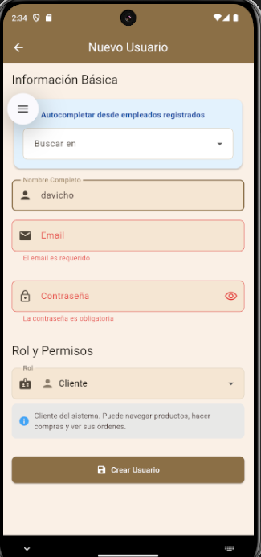

</div>

> Interfaz de creación de usuario mostrando campos de email, contraseña con indicador de fortaleza, nombre, selector de rol y ubicación asignada. Se observan validaciones en tiempo real.

#### **Registro de Clientes (Customer Signup)**

Los clientes pueden auto-registrarse mediante la pantalla "Crear cuenta" con información adicional (CI, teléfono, dirección).

**Flujo de auto-registro:**

1. Usuario accede a "Crear cuenta" desde login
2. Completa formulario extendido con sanitización:
   - Email
   - Contraseña (con indicador de fortaleza)
   - Nombre completo
   - CI (Cédula de Identidad)
   - Teléfono
   - Dirección
3. Sistema sanitiza inputs con `InputSanitizer`
4. Sistema valida fortaleza de contraseña con `PasswordValidator`
5. Supabase Auth crea usuario con rol 'customer'
6. Sistema crea entrada en `public.customers` con info adicional
7. Usuario recibe confirmación y es redirigido

**Código de sanitización en registro:**

```dart
// lib/features/auth/presentation/pages/customer_signup_page.dart (líneas fragmentadas)
final sanitizedEmail = InputSanitizer.sanitizeEmail(_emailController.text);
final sanitizedName = InputSanitizer.sanitizeName(_nameController.text);
final sanitizedCi = InputSanitizer.sanitizeCi(_ciController.text);
final sanitizedPhone = InputSanitizer.sanitizePhone(_phoneController.text);
final sanitizedAddress = InputSanitizer.sanitizeAddress(_addressController.text);

final warnings = InputSanitizer.firstSafetyWarning([
  sanitizedEmail,
  sanitizedName,
  sanitizedCi,
  sanitizedPhone,
  sanitizedAddress,
]);

if (warnings != null) {
  ScaffoldMessenger.of(context).showSnackBar(
    SnackBar(content: Text(warnings), backgroundColor: Colors.orange),
  );
  return;
}
```

<div align="center">

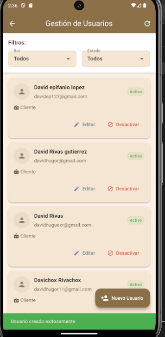

</div>

> Formulario de registro mostrando indicador de fortaleza de contraseña en tiempo real, campos adicionales (CI, teléfono, dirección) y mensajes de validación.

#### **Modificación de Usuarios (Update)**

Los administradores pueden modificar información de usuarios existentes.

**Campos modificables:**
- Nombre
- Rol (admin, store_manager, warehouse_manager, customer)
- Ubicación asignada (tienda o almacén)
- Estado activo/inactivo

**Código de actualización:**

```dart
// lib/features/users/presentation/bloc/user_management_bloc.dart (líneas 156-221)
Future<void> _onUpdateUser(
  UpdateUser event,
  Emitter<UserManagementState> emit,
) async {
  emit(UserManagementLoading());

  final result = await updateUser(
    userId: event.userId,
    name: event.name,
    role: event.role,
    assignedLocationId: event.assignedLocationId,
    assignedLocationType: event.assignedLocationType,
    isActive: event.isActive,
  );

  result.fold(
    (failure) async {
      // Log de seguridad: Actualización fallida
      await AppLogger.logSecurityEvent(
        eventType: SecurityEventType.userModification,
        userId: admin.id,
        userEmail: admin.email,
        targetUserId: event.userId,
        action: 'UPDATE_USER',
        success: false,
        details: 'Error actualizando usuario: ${failure.message}',
      );

      emit(UserManagementError(failure.message));
    },
    (user) async {
      // Log de seguridad: Usuario actualizado exitosamente
      await AppLogger.logSecurityEvent(
        eventType: SecurityEventType.userModification,
        userId: admin.id,
        userEmail: admin.email,
        targetUserId: user.id,
        targetResource: user.email,
        action: 'UPDATE_USER',
        success: true,
        details: 'Usuario actualizado: ${user.name}',
        metadata: {
          'newRole': user.role,
          'newLocation': user.assignedLocationId,
          'isActive': user.isActive,
        },
      );

      emit(UserUpdated(user: user));
    },
  );
}
```

<div align="center">

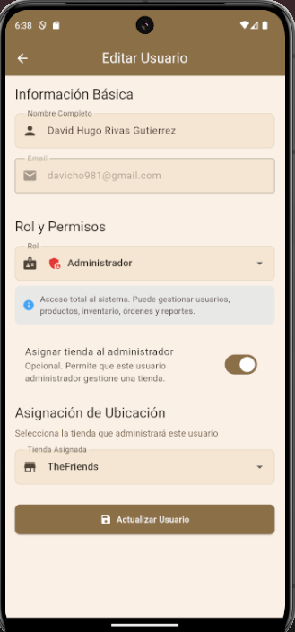

</div>

> Formulario de edición de usuario con campos pre-poblados, selector de rol y estado activo/inactivo.

#### **Baja de Usuarios (Soft Delete)**

El sistema implementa **soft delete** (desactivación) en lugar de eliminación física para mantener integridad referencial y auditoría.

**Proceso de desactivación:**

1. Administrador selecciona usuario a desactivar
2. Sistema muestra confirmación
3. Al confirmar, se actualiza `is_active = false`
4. Usuario no puede iniciar sesión
5. Datos históricos se mantienen
6. Se registra evento de seguridad

**Código de desactivación:**

```dart
// lib/features/users/presentation/bloc/user_management_bloc.dart (líneas 223-275)
Future<void> _onDeactivateUser(
  DeactivateUser event,
  Emitter<UserManagementState> emit,
) async {
  emit(UserManagementLoading());

  final result = await deactivateUser(event.userId);

  result.fold(
    (failure) async {
      // Log de seguridad: Desactivación fallida
      await AppLogger.logSecurityEvent(
        eventType: SecurityEventType.userDeletion,
        userId: admin.id,
        userEmail: admin.email,
        targetUserId: event.userId,
        action: 'DEACTIVATE_USER',
        success: false,
        details: 'Error desactivando usuario: ${failure.message}',
      );

      emit(UserManagementError(failure.message));
    },
    (_) async {
      // Log de seguridad: Usuario desactivado exitosamente
      await AppLogger.logSecurityEvent(
        eventType: SecurityEventType.userDeletion,
        userId: admin.id,
        userEmail: admin.email,
        targetUserId: event.userId,
        action: 'DEACTIVATE_USER',
        success: true,
        details: 'Usuario desactivado exitosamente',
      );

      emit(UserDeactivated());
    },
  );
}
```

<div align="center">

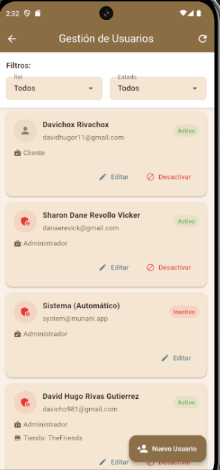

</div>

> Vista de administración de usuarios mostrando tabla con columnas de nombre, email, rol, ubicación, estado (activo/inactivo) y acciones (editar/desactivar). Los usuarios inactivos aparecen en gris.

### 3.1.3 Trigger de Sincronización de Metadata

Para mantener sincronizados los datos entre `auth.users` (Supabase Auth) y `public.users` (metadata), se implementó un trigger de base de datos.

**Trigger `handle_new_user`:**

```sql
-- sql/fase1/04_functions.sql (líneas 22-80)
CREATE OR REPLACE FUNCTION public.handle_new_user()
RETURNS TRIGGER AS $$
DECLARE
  user_role TEXT;
  user_assigned_location_id TEXT;
  user_assigned_location_type TEXT;
BEGIN
  -- Extraer metadata del usuario
  user_role := COALESCE(NEW.raw_user_meta_data->>'role', 'customer');
  user_assigned_location_id := NEW.raw_user_meta_data->>'assigned_location_id';
  user_assigned_location_type := NEW.raw_user_meta_data->>'assigned_location_type';

  -- Insertar en public.users
  INSERT INTO public.users (
    id,
    email,
    name,
    role,
    assigned_location_id,
    assigned_location_type
  )
  VALUES (
    NEW.id,
    NEW.email,
    COALESCE(NEW.raw_user_meta_data->>'name', 'Usuario'),
    user_role,
    CASE WHEN user_assigned_location_id IS NOT NULL
         THEN user_assigned_location_id::uuid
         ELSE NULL END,
    user_assigned_location_type
  );

  RETURN NEW;
END;
$$ LANGUAGE plpgsql SECURITY DEFINER;

-- Crear trigger
CREATE TRIGGER on_auth_user_created
  AFTER INSERT ON auth.users
  FOR EACH ROW EXECUTE FUNCTION public.handle_new_user();
```

### 3.1.4 Auditoría de Operaciones

Todas las operaciones de ABM de usuarios son registradas en logs de seguridad (ver sección 3.6.2 A09) con la siguiente información:

- Timestamp (ISO 8601)
- Tipo de evento (userCreation, userModification, userDeletion)
- Usuario que realiza la acción (ID y email)
- Usuario afectado (ID y email)
- Acción específica (CREATE_USER, UPDATE_USER, DEACTIVATE_USER)
- Resultado (success: true/false)
- Detalles adicionales
- Metadata (rol asignado, ubicación, etc.)

**Ejemplo de log JSON generado:**

```json
{
  "timestamp": "2025-01-10T15:30:45.123Z",
  "eventType": "userCreation",
  "severity": "HIGH",
  "userId": "admin-uuid-123",
  "userEmail": "adm***@munani.com",
  "targetUserId": "new-user-uuid-456",
  "targetResource": "man***@munani.com",
  "action": "CREATE_USER",
  "success": true,
  "details": "Nuevo usuario creado: Juan Pérez con rol store_manager",
  "metadata": {
    "targetRole": "store_manager",
    "targetName": "Juan Pérez",
    "assignedLocation": "store-uuid-789"
  }
}
```

<div align="center">

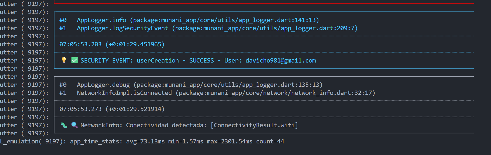

</div>

> Generar y capturar el log JSON de creación de usuario con redacción parcial de datos sensibles.

### 3.1.5 Evidencias de Funcionalidad

Las siguientes capturas de pantalla demuestran la funcionalidad implementada:

<div align="center">


</div>

> Serie de capturas mostrando: (1) dashboard administrador con acceso a Usuarios, (2) listado de usuarios existentes, (3) formulario con validaciones, (4) confirmación de creación, (5) edición, (6) desactivación y (7) verificación en Supabase.

---

## 3.2 Gestión de Contraseñas (A07: Fallas de Autenticación)

### 3.2.1 Algoritmo de Hashing: Argon2

El sistema utiliza **Argon2**, el algoritmo ganador de la Password Hashing Competition (PHC), para el almacenamiento seguro de contraseñas. Este algoritmo es implementado de forma nativa por Supabase Auth.

**Características de Argon2:**

- **Resistente a GPU/ASIC**: Diseñado para ser costoso en memoria, dificultando ataques con hardware especializado
- **Parámetros configurables**: Memoria, iteraciones y paralelismo ajustables
- **Protección contra timing attacks**: Tiempo de ejecución constante

**Configuración de Argon2 en Supabase:**
- Memoria: 64MB
- Iteraciones: 3
- Paralelismo: 1
- Salt: 16 bytes aleatorios por contraseña

### 3.2.2 Política de Contraseñas: NIST/OWASP

El sistema implementa una política de contraseñas robusta basada en las recomendaciones de NIST SP 800-63B y OWASP.

**Requisitos de contraseña implementados:**

1. **Longitud mínima**: 8 caracteres
2. **Complejidad**:
   - Al menos 1 letra mayúscula (A-Z)
   - Al menos 1 letra minúscula (a-z)
   - Al menos 1 número (0-9)
   - Al menos 1 símbolo especial (!@#$%^&*(),.?\":{}|<>)
3. **Blacklist de contraseñas comunes**: 100+ contraseñas débiles bloqueadas
4. **Detección de patrones débiles**:
   - Secuencias (123456, abcdef)
   - Repeticiones (aaaaaa, 111111)
   - Palabras del diccionario

**Código del validador de contraseñas:**

```dart
// lib/core/utils/password_validator.dart (líneas completas)
class PasswordValidator {
  // Longitud mínima
  static const int minLength = 8;

  // Blacklist de contraseñas comunes (top 100)
  static final Set<String> commonPasswords = {
    'password', '123456', '12345678', 'qwerty', 'abc123',
    'monkey', '1234567', 'letmein', 'trustno1', 'dragon',
    'baseball', '111111', 'iloveyou', 'master', 'sunshine',
    'ashley', 'bailey', 'passw0rd', 'shadow', '123123',
    '654321', 'superman', 'qazwsx', 'michael', 'football',
    // ... más contraseñas comunes
  };

  // Validación completa
  static PasswordValidationResult validate(String password) {
    final errors = <String>[];

    // Longitud mínima
    if (password.length < minLength) {
      errors.add('La contraseña debe tener al menos $minLength caracteres');
    }

    // Mayúsculas
    if (!password.contains(RegExp(r'[A-Z]'))) {
      errors.add('Debe contener al menos una letra mayúscula');
    }

    // Minúsculas
    if (!password.contains(RegExp(r'[a-z]'))) {
      errors.add('Debe contener al menos una letra minúscula');
    }

    // Números
    if (!password.contains(RegExp(r'[0-9]'))) {
      errors.add('Debe contener al menos un número');
    }

    // Símbolos
    if (!password.contains(RegExp(r'[!@#$%^&*(),.?":{}|<>]'))) {
      errors.add('Debe contener al menos un símbolo especial (!@#$%^&*...)');
    }

    // Blacklist
    if (commonPasswords.contains(password.toLowerCase())) {
      errors.add('Esta contraseña es muy común y no está permitida');
    }

    // Patrones débiles
    if (_hasSequence(password)) {
      errors.add('No debe contener secuencias obvias (123, abc)');
    }

    if (_hasRepetition(password)) {
      errors.add('No debe contener caracteres repetidos excesivamente');
    }

    return PasswordValidationResult(
      isValid: errors.isEmpty,
      errors: errors,
      strength: _calculateStrength(password),
    );
  }

  // Calcular fortaleza (0-100)
  static int _calculateStrength(String password) {
    int strength = 0;

    // Longitud
    strength += (password.length * 4).clamp(0, 40);

    // Variedad de caracteres
    if (password.contains(RegExp(r'[A-Z]'))) strength += 10;
    if (password.contains(RegExp(r'[a-z]'))) strength += 10;
    if (password.contains(RegExp(r'[0-9]'))) strength += 10;
    if (password.contains(RegExp(r'[!@#$%^&*(),.?":{}|<>]'))) strength += 15;

    // Penalizaciones
    if (_hasSequence(password)) strength -= 15;
    if (_hasRepetition(password)) strength -= 15;
    if (commonPasswords.contains(password.toLowerCase())) strength = 0;

    return strength.clamp(0, 100);
  }

  static bool _hasSequence(String password) {
    final lower = password.toLowerCase();
    final sequences = ['123', '234', '345', '456', '567', '678', '789',
                       'abc', 'bcd', 'cde', 'def', 'efg', 'fgh'];
    return sequences.any((seq) => lower.contains(seq));
  }

  static bool _hasRepetition(String password) {
    return RegExp(r'(.)\1{3,}').hasMatch(password);
  }
}
```


### 3.2.3 Indicador Visual de Fortaleza de Contraseña

Se implementó un widget reutilizable que muestra en tiempo real la fortaleza de la contraseña mientras el usuario escribe.

**Código del indicador:**

```dart
// lib/core/widgets/password_strength_indicator.dart
class PasswordStrengthIndicator extends StatelessWidget {
  final String password;

  const PasswordStrengthIndicator({
    super.key,
    required this.password,
  });

  @override
  Widget build(BuildContext context) {
    final result = PasswordValidator.validate(password);
    final strength = result.strength;

    Color getColor() {
      if (strength < 30) return Colors.red;
      if (strength < 60) return Colors.orange;
      if (strength < 80) return Colors.yellow;
      return Colors.green;
    }

    String getLabel() {
      if (strength < 30) return 'Débil';
      if (strength < 60) return 'Media';
      if (strength < 80) return 'Buena';
      return 'Fuerte';
    }

    return Column(
      crossAxisAlignment: CrossAxisAlignment.start,
      children: [
        Row(
          children: [
            Expanded(
              child: LinearProgressIndicator(
                value: strength / 100,
                backgroundColor: Colors.grey[300],
                valueColor: AlwaysStoppedAnimation<Color>(getColor()),
                minHeight: 8,
              ),
            ),
            const SizedBox(width: 12),
            Text(
              getLabel(),
              style: TextStyle(
                color: getColor(),
                fontWeight: FontWeight.bold,
              ),
            ),
          ],
        ),
        if (result.errors.isNotEmpty) ...[
          const SizedBox(height: 8),
          ...result.errors.map((error) => Padding(
            padding: const EdgeInsets.only(top: 4),
            child: Row(
              children: [
                const Icon(Icons.error_outline, size: 16, color: Colors.red),
                const SizedBox(width: 4),
                Expanded(
                  child: Text(
                    error,
                    style: const TextStyle(fontSize: 12, color: Colors.red),
                  ),
                ),
              ],
            ),
          )),
        ],
      ],
    );
  }
}
```

<div align="center">

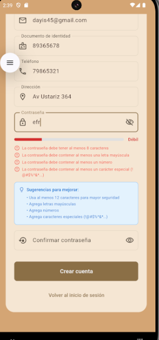

</div>

> Captura del formulario de registro mostrando el indicador de fortaleza con barra de progreso (rojo/débil, naranja/media, verde/fuerte) y lista de requisitos pendientes.

### 3.2.4 Rate Limiting y Bloqueo por Intentos Fallidos

Para prevenir ataques de fuerza bruta (OWASP A07), se implementó un servicio de rate limiting con bloqueo exponencial.

**Características del Rate Limiter:**

- **Máximo de intentos**: 5 intentos fallidos
- **Bloqueos exponenciales**:
  - 1er bloqueo: 5 minutos
  - 2do bloqueo: 10 minutos
  - 3er bloqueo: 20 minutos
  - 4to bloqueo: 60 minutos
- **Almacenamiento**: SharedPreferences (local)
- **Logging de eventos**: Registro de bloqueos en logs de seguridad

**Código del Rate Limiter:**

```dart
// lib/core/services/rate_limiter_service.dart
class RateLimiterService {
  final SharedPreferences _prefs;

  static const int maxAttempts = 5;
  static const List<int> blockDurations = [5, 10, 20, 60]; // minutos

  RateLimiterService(this._prefs);

  Future<bool> isBlocked(String email) async {
    final blockUntilStr = _prefs.getString('block_until_$email');
    if (blockUntilStr == null) return false;

    final blockUntil = DateTime.parse(blockUntilStr);
    final now = DateTime.now();

    if (now.isBefore(blockUntil)) {
      return true; // Aún bloqueado
    } else {
      // Bloqueo expirado, limpiar
      await _prefs.remove('block_until_$email');
      return false;
    }
  }

  Future<int> getRemainingBlockTime(String email) async {
    final blockUntilStr = _prefs.getString('block_until_$email');
    if (blockUntilStr == null) return 0;

    final blockUntil = DateTime.parse(blockUntilStr);
    final now = DateTime.now();
    final remaining = blockUntil.difference(now).inMinutes;

    return remaining > 0 ? remaining : 0;
  }

  Future<bool> recordFailedAttempt(String email) async {
    final attempts = await getFailedAttempts(email);
    final newAttempts = attempts + 1;

    await _prefs.setInt('failed_attempts_$email', newAttempts);

    if (newAttempts >= maxAttempts) {
      // Bloquear
      await _blockUser(email, newAttempts - maxAttempts);
      return true;
    }

    return false;
  }

  Future<void> _blockUser(String email, int blockLevel) async {
    final durationIndex = (blockLevel).clamp(0, blockDurations.length - 1);
    final blockMinutes = blockDurations[durationIndex];
    final blockUntil = DateTime.now().add(Duration(minutes: blockMinutes));

    await _prefs.setString('block_until_$email', blockUntil.toIso8601String());
    await _prefs.setInt('block_level_$email', blockLevel);
  }

  Future<void> recordSuccessfulAttempt(String email) async {
    // Limpiar intentos fallidos en login exitoso
    await _prefs.remove('failed_attempts_$email');
    await _prefs.remove('block_until_$email');
    await _prefs.remove('block_level_$email');
  }

  Future<int> getFailedAttempts(String email) async {
    return _prefs.getInt('failed_attempts_$email') ?? 0;
  }
}
```


### 3.2.5 Integración con AuthBloc

El rate limiter se integra con el flujo de autenticación:

```dart
// lib/features/auth/presentation/bloc/auth_bloc.dart (líneas 100-219)
Future<void> _onAuthLoginRequested(
  AuthLoginRequested event,
  Emitter<bloc_state.AuthState> emit,
) async {
  emit(const bloc_state.AuthLoading());

  final sanitizedEmail = InputSanitizer.sanitizeEmail(event.email);
  final email = sanitizedEmail.toLowerCase().trim();

  // 1. Verificar si está bloqueado
  final isBlocked = await rateLimiterService.isBlocked(email);
  if (isBlocked) {
    final remainingMinutes = await rateLimiterService.getRemainingBlockTime(email);
    final errorMessage = 'Demasiados intentos fallidos. '
        'Tu cuenta está temporalmente bloqueada. '
        'Intenta nuevamente en $remainingMinutes minuto(s).';

    // Log de seguridad: Bloqueo por rate limiting
    await AppLogger.logSecurityEvent(
      eventType: SecurityEventType.loginBlocked,
      userId: 'unknown',
      userEmail: email,
      success: false,
      details: 'Usuario bloqueado por $remainingMinutes minutos',
      metadata: {'remainingMinutes': remainingMinutes},
    );

    emit(bloc_state.AuthError(message: errorMessage));
    return;
  }

  // 2. Intentar login
  final result = await loginUseCase(LoginParams(
    email: email,
    password: event.password,
  ));

  await result.fold(
    (failure) async {
      // Login fallido: registrar intento
      final nowBlocked = await rateLimiterService.recordFailedAttempt(email);
      final failedAttempts = await rateLimiterService.getFailedAttempts(email);

      String errorMessage = 'Email o contraseña incorrectos.';

      if (nowBlocked) {
        final blockTime = await rateLimiterService.getRemainingBlockTime(email);
        errorMessage += '\\n\\nCuenta bloqueada temporalmente por $blockTime minuto(s).';
      } else if (failedAttempts > 0) {
        final remaining = RateLimiterService.maxAttempts - failedAttempts;
        errorMessage += '\\n\\nIntentos restantes antes de bloqueo: $remaining';
      }

      // Log de seguridad: Login fallido
      await AppLogger.logSecurityEvent(
        eventType: SecurityEventType.loginAttempt,
        userId: 'unknown',
        userEmail: email,
        success: false,
        details: 'Credenciales inválidas',
        metadata: {
          'failedAttempts': failedAttempts,
          'remainingAttempts': RateLimiterService.maxAttempts - failedAttempts,
          'nowBlocked': nowBlocked,
        },
      );

      emit(bloc_state.AuthError(message: errorMessage));
    },
    (user) async {
      // Login exitoso: limpiar intentos
      await rateLimiterService.recordSuccessfulAttempt(email);

      // Log de seguridad: Login exitoso
      await AppLogger.logSecurityEvent(
        eventType: SecurityEventType.loginAttempt,
        userId: user.id,
        userEmail: user.email,
        success: true,
        details: 'Login exitoso - Rol: ${user.role}',
        metadata: {
          'role': user.role,
          'userName': user.name,
        },
      );

      emit(bloc_state.AuthAuthenticated(user: user));
    },
  );
}
```

<div align="center">

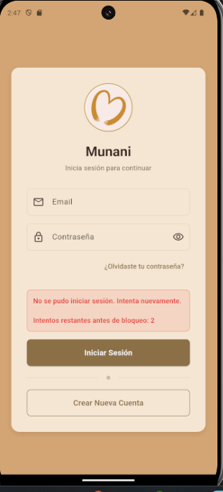

</div>

> Mensaje genérico tras intento fallido: “Email o contraseña incorrectos. Intentos restantes antes de bloqueo: 3”.

<div align="center">

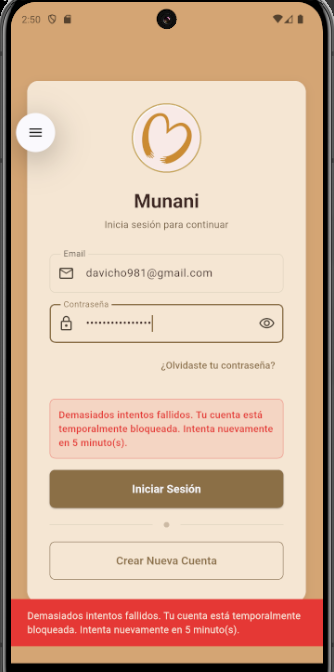

</div>

> Mensaje ante bloqueo: “Demasiados intentos fallidos. Tu cuenta está temporalmente bloqueada. Intenta nuevamente en 5 minuto(s).”.

### 3.2.6 Recuperación de Contraseña (Forgot Password)

El sistema proporciona funcionalidad de recuperación de contraseña mediante enlace de restablecimiento enviado por correo electrónico.

**Flujo de recuperación:**

1. Usuario accede a "¿Olvidaste tu contraseña?" desde login
2. Ingresa email (con sanitización)
3. Sistema valida formato de email
4. Supabase Auth envía email con enlace de restablecimiento
5. Usuario hace clic en enlace (deep link)
6. Aplicación abre pantalla de restablecimiento con tokens
7. Usuario ingresa nueva contraseña (con validación)
8. Sistema actualiza contraseña con Argon2
9. Usuario es redirigido a login

**Código de solicitud de restablecimiento:**

```dart
// lib/features/auth/presentation/pages/forgot_password_page.dart (fragmento)
final sanitizedEmail = InputSanitizer.sanitizeEmail(_emailController.text);

if (sanitizedEmail.isEmpty || !sanitizedEmail.contains('@')) {
  ScaffoldMessenger.of(context).showSnackBar(
    const SnackBar(
      content: Text('Por favor ingresa un email válido'),
      backgroundColor: Colors.red,
    ),
  );
  return;
}

context.read<AuthBloc>().add(
  AuthResetPasswordRequested(email: sanitizedEmail),
);
```

<div align="center">


</div>

> Interfaz mostrando campo de email y botón “Enviar enlace de restablecimiento”. Tras envío exitoso, se muestra mensaje de confirmación verde.

<div align="center">


</div>

> Correo de restablecimiento enviado por Supabase con enlace seguro.

### 3.2.7 Tiempo de Vida Útil de Contraseñas

**Configuración actual:**
- **No hay expiración forzada** (siguiendo recomendaciones modernas de NIST SP 800-63B)
- **Cambio voluntario**: Los usuarios pueden cambiar su contraseña en cualquier momento desde su perfil
- **Cambio forzado**: Solo se requiere cambio de contraseña en caso de:
  - Compromiso detectado de cuenta
  - Restablecimiento solicitado por el usuario
  - Desactivación y reactivación de cuenta

**Justificación:**
NIST SP 800-63B (actualización 2017) ya no recomienda expiración forzada de contraseñas, ya que esto lleva a patrones predecibles (password1, password2, etc.) y no mejora la seguridad real.

### 3.2.8 MFA (Multi-Factor Authentication)

**Estado actual:**
- **Pendiente de implementación**
- Supabase Auth soporta MFA con TOTP (Time-based One-Time Password)
- Roadmap incluye implementación de MFA opcional para usuarios administradores

**Plan de implementación (futuro):**
1. Habilitar MFA en Supabase Dashboard
2. Agregar pantalla de configuración de MFA en perfil de usuario
3. Integrar generador de códigos QR para apps authenticator (Google Authenticator, Authy)
4. Implementar validación de código TOTP en login
5. Códigos de respaldo (backup codes) en caso de pérdida de dispositivo

<div align="center">

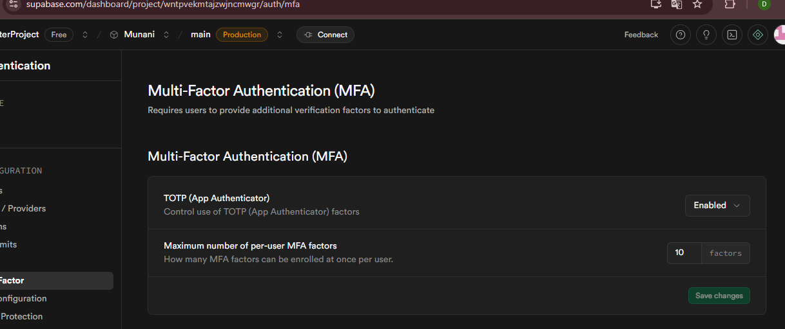

</div>

> Panel de Supabase Auth donde se habilita MFA/TOTP para los proyectos.

---

## 3.3 Gestión de Roles (A01: Pérdida de Control de Acceso)

### 3.3.1 Matriz de Roles y Permisos

El sistema implementa un modelo de control de acceso basado en roles (RBAC - Role-Based Access Control) con cuatro roles definidos:

1. **admin** - Administrador del sistema
2. **store_manager** - Encargado de tienda
3. **warehouse_manager** - Encargado de almacén
4. **customer** - Cliente

**Matriz completa de permisos por módulo:**

| Módulo | Admin | Store Manager | Warehouse Manager | Customer |
|--------|-------|---------------|-------------------|----------|
| **Usuarios** | CRUD | - | - | - |
| **Productos** | CRUD | Lectura | Lectura | Lectura (catálogo) |
| **Ubicaciones (Tiendas)** | CRUD | Lectura (su tienda) | Lectura | - |
| **Ubicaciones (Almacenes)** | CRUD | Lectura | Lectura (su almacén) | - |
| **Inventario** | CRUD | Lectura (su tienda) | Lectura (su almacén) | Lectura (catálogo) |
| **Transferencias** | CRUD (todas) | CRUD (su tienda) | CRUD (su almacén) | - |
| **Compras** | CRUD | Lectura | CRUD (su almacén) | - |
| **Proveedores** | CRUD | Lectura | CRUD | - |
| **Empleados** | CRUD | - | - | - |
| **Ventas** | CRUD (todas) | CRUD (su tienda) | Lectura | - |
| **Clientes** | CRUD | Lectura (su tienda) | Lectura | Lectura (propio perfil) |
| **Carrito** | Lectura (todos) | Lectura (su tienda) | Lectura | CRUD (propio) |
| **Reportes** | Todos | Su tienda | Su almacén | - |
| **Sincronización** | Todos los datos | Datos de su tienda | Datos de su almacén | Datos propios |


### 3.3.2 Row Level Security (RLS) en PostgreSQL

El sistema implementa Row Level Security (RLS) de PostgreSQL para aplicar control de acceso a nivel de base de datos, asegurando que las políticas de seguridad se cumplan incluso si se accede directamente a la base de datos.

**Funciones Helper para RLS:**

```sql
-- sql/fase2/05_functions.sql

-- Verificar si el usuario actual es administrador
CREATE OR REPLACE FUNCTION public.is_admin()
RETURNS BOOLEAN AS $$
BEGIN
  RETURN COALESCE(
    (auth.jwt() ->> 'role')::TEXT = 'admin',
    false
  );
END;
$$ LANGUAGE plpgsql SECURITY DEFINER;

-- Verificar si el usuario actual es encargado de tienda
CREATE OR REPLACE FUNCTION public.is_store_manager()
RETURNS BOOLEAN AS $$
BEGIN
  RETURN COALESCE(
    (auth.jwt() ->> 'role')::TEXT = 'store_manager',
    false
  );
END;
$$ LANGUAGE plpgsql SECURITY DEFINER;

-- Verificar si el usuario actual es encargado de almacén
CREATE OR REPLACE FUNCTION public.is_warehouse_manager()
RETURNS BOOLEAN AS $$
BEGIN
  RETURN COALESCE(
    (auth.jwt() ->> 'role')::TEXT = 'warehouse_manager',
    false
  );
END;
$$ LANGUAGE plpgsql SECURITY DEFINER;
```

<div align="center">

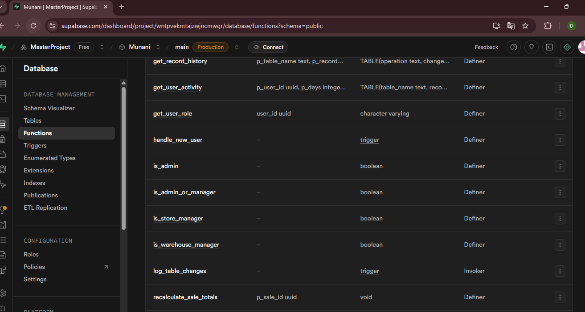

</div>

> Funciones PL/pgSQL (`is_admin`, `is_store_manager`, `is_warehouse_manager`) que leen el JWT para RLS.

**Ejemplo de políticas RLS implementadas:**

```sql
-- sql/fase1/06_rls_policies.sql

-- Habilitar RLS en tabla users
ALTER TABLE public.users ENABLE ROW LEVEL SECURITY;

-- Política: Administradores pueden ver todos los usuarios
CREATE POLICY "Admins can view all users"
ON public.users
FOR SELECT
USING (public.is_admin());

-- Política: Usuarios pueden ver su propio perfil
CREATE POLICY "Users can view own profile"
ON public.users
FOR SELECT
USING (id = auth.uid());

-- Política: Solo administradores pueden crear usuarios
CREATE POLICY "Only admins can create users"
ON public.users
FOR INSERT
WITH CHECK (public.is_admin());

-- Política: Solo administradores pueden actualizar usuarios
CREATE POLICY "Only admins can update users"
ON public.users
FOR UPDATE
USING (public.is_admin());

-- Política: Solo administradores pueden eliminar usuarios
CREATE POLICY "Only admins can delete users"
ON public.users
FOR DELETE
USING (public.is_admin());
```

<div align="center">

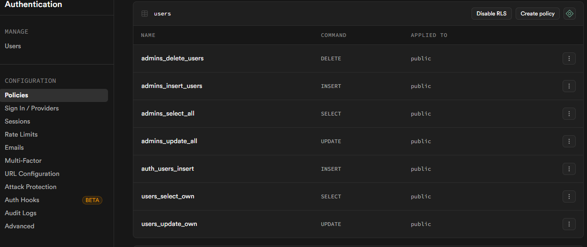

</div>

> Políticas RLS de `public.users` que restringen operaciones por rol.

**Políticas RLS en Inventario (filtrado por ubicación):**

```sql
-- sql/fase4/05_rls_policies.sql

ALTER TABLE public.inventory ENABLE ROW LEVEL SECURITY;

-- Administradores: acceso total
CREATE POLICY "Admins can view all inventory"
ON public.inventory
FOR SELECT
USING (public.is_admin());

-- Store Managers: solo su tienda
CREATE POLICY "Store managers can view their store inventory"
ON public.inventory
FOR SELECT
USING (
  public.is_store_manager()
  AND location_type = 'store'
  AND location_id = (auth.jwt() ->> 'assigned_location_id')::uuid
);

-- Warehouse Managers: solo su almacén
CREATE POLICY "Warehouse managers can view their warehouse inventory"
ON public.inventory
FOR SELECT
USING (
  public.is_warehouse_manager()
  AND location_type = 'warehouse'
  AND location_id = (auth.jwt() ->> 'assigned_location_id')::uuid
);

-- Clientes: solo lectura de catálogo (productos activos)
CREATE POLICY "Customers can view catalog"
ON public.inventory
FOR SELECT
USING (
  (auth.jwt() ->> 'role')::TEXT = 'customer'
  AND EXISTS (
    SELECT 1 FROM public.product_variants pv
    WHERE pv.id = product_variant_id
    AND pv.is_active = true
  )
);
```

<div align="center">


</div>

> Políticas RLS de `public.inventory` en Supabase resaltando filtros por `location_type` y `assigned_location_id`.

**Políticas RLS en Carrito:**

```sql
-- sql/fase10/02_rls.sql

ALTER TABLE public.carts ENABLE ROW LEVEL SECURITY;

-- SELECT: Clientes ven solo su carrito, managers ven de su ubicación, admins ven todo
CREATE POLICY "carts_select_policy" ON public.carts
FOR SELECT USING (
  customer_id = auth.uid()
  OR public.is_admin()
  OR (
    public.is_store_manager() AND location_type = 'store' AND EXISTS (
      SELECT 1 FROM public.stores s
      WHERE s.id = location_id
        AND s.manager_id = auth.uid()
    )
  )
  OR (
    public.is_warehouse_manager() AND location_type = 'warehouse' AND EXISTS (
      SELECT 1 FROM public.warehouses w
      WHERE w.id = location_id
        AND w.manager_id = auth.uid()
    )
  )
);

-- INSERT: Solo clientes pueden crear su propio carrito
CREATE POLICY "carts_insert_policy" ON public.carts
FOR INSERT WITH CHECK (
  customer_id = auth.uid()
  AND (auth.jwt() ->> 'role')::TEXT = 'customer'
);

-- UPDATE: Solo el dueño del carrito puede actualizarlo
CREATE POLICY "carts_update_policy" ON public.carts
FOR UPDATE USING (
  customer_id = auth.uid()
);

-- DELETE: Solo el dueño del carrito puede eliminarlo
CREATE POLICY "carts_delete_policy" ON public.carts
FOR DELETE USING (
  customer_id = auth.uid()
);
```

<div align="center">

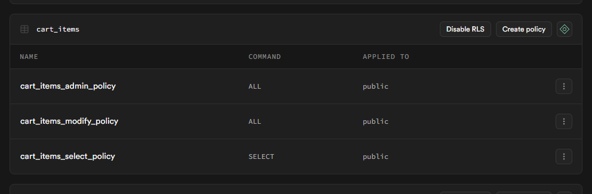

</div>

> Políticas que permiten a clientes gestionar solo su carrito, mientras managers y admins tienen acceso de lectura según ubicación.

### 3.3.3 UI Condicional Basada en Roles

La interfaz de usuario adapta dinámicamente la visualización de módulos y funcionalidades según el rol del usuario autenticado.

**Dashboard del Administrador:**

```dart
// lib/features/auth/presentation/pages/home_page.dart (fragmento)
Widget _buildAdminDashboard(User user) {
  return GridView.count(
    crossAxisCount: 2,
    children: [
      _buildDashboardCard(
        title: 'Productos',
        icon: Icons.inventory,
        color: AppColors.primaryCaramel,
        onTap: () => Navigator.pushNamed(context, '/products'),
      ),
      _buildDashboardCard(
        title: 'Inventario',
        icon: Icons.warehouse,
        color: AppColors.accentGold,
        onTap: () => Navigator.pushNamed(context, '/inventory'),
      ),
      _buildDashboardCard(
        title: 'Ventas',
        icon: Icons.point_of_sale,
        color: Colors.green,
        onTap: () => Navigator.pushNamed(context, '/sales'),
      ),
      _buildDashboardCard(
        title: 'Compras',
        icon: Icons.shopping_cart,
        color: Colors.blue,
        onTap: () => Navigator.pushNamed(context, '/purchases'),
      ),
      _buildDashboardCard(
        title: 'Transferencias',
        icon: Icons.swap_horiz,
        color: Colors.purple,
        onTap: () => Navigator.pushNamed(context, '/transfers'),
      ),
      _buildDashboardCard(
        title: 'Usuarios',
        icon: Icons.people,
        color: Colors.red,
        onTap: () => Navigator.pushNamed(context, '/users'),
      ),
      _buildDashboardCard(
        title: 'Empleados',
        icon: Icons.badge,
        color: Colors.teal,
        onTap: () => Navigator.pushNamed(context, '/employees'),
      ),
      _buildDashboardCard(
        title: 'Reportes',
        icon: Icons.analytics,
        color: Colors.indigo,
        onTap: () => Navigator.pushNamed(context, '/reports'),
      ),
    ],
  );
}
```

<div align="center">

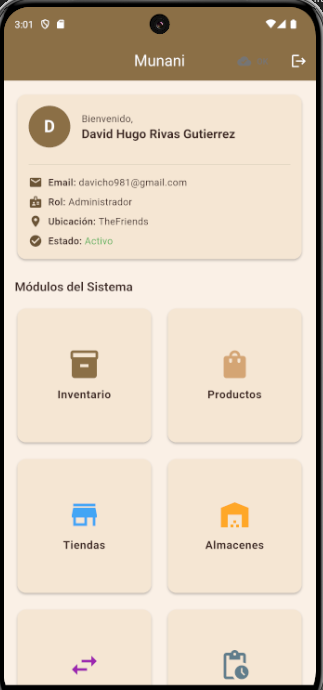

</div>

> Captura mostrando tarjetas de acceso a todos los módulos: Productos, Inventario, Ventas, Compras, Transferencias, Usuarios, Empleados y Reportes.

**Dashboard del Cliente:**

```dart
Widget _buildCustomerDashboard(User user) {
  return GridView.count(
    crossAxisCount: 2,
    children: [
      _buildDashboardCard(
        title: 'Catálogo',
        icon: Icons.storefront,
        color: AppColors.primaryCaramel,
        onTap: () => Navigator.pushNamed(context, '/catalog'),
      ),
      _buildDashboardCard(
        title: 'Mi Carrito',
        icon: Icons.shopping_cart,
        color: AppColors.accentGold,
        onTap: () => Navigator.pushNamed(context, '/cart'),
      ),
      _buildDashboardCard(
        title: 'Mis Pedidos',
        icon: Icons.receipt_long,
        color: Colors.blue,
        onTap: () => Navigator.pushNamed(context, '/my-orders'),
      ),
      _buildDashboardCard(
        title: 'Mi Perfil',
        icon: Icons.person,
        color: Colors.green,
        onTap: () => Navigator.pushNamed(context, '/profile'),
      ),
    ],
  );
}
```

<div align="center">

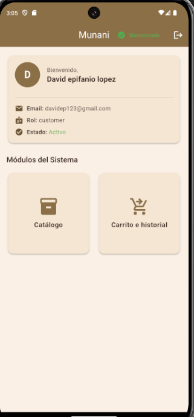

</div>

> Acceso limitado solo a Catálogo, Carrito e historial personal; sin módulos administrativos.

### 3.3.4 Validación de Permisos en Capa de Aplicación

Además de RLS en base de datos, el sistema valida permisos en la capa de aplicación para mejorar la experiencia de usuario y evitar llamadas innecesarias a la API.

**Ejemplo en UserManagementBloc:**

```dart
// lib/features/users/presentation/bloc/user_management_bloc.dart (líneas 64-93)
Future<void> _onCreateUser(
  CreateUser event,
  Emitter<UserManagementState> emit,
) async {
  emit(UserManagementLoading());

  // Verificar permisos de administrador ANTES de crear usuario
  AppLogger.debug('🔍 Verificando permisos de administrador...');

  final currentUserResult = await getCurrentUser();

  currentUserResult.fold(
    (failure) {
      AppLogger.error('❌ Error obteniendo usuario actual: ${failure.message}');
      emit(UserManagementError('No se pudo verificar permisos: ${failure.message}'));
      return;
    },
    (currentUser) {
      if (!currentUser.isAdmin) {
        AppLogger.warning('❌ Usuario actual NO es administrador: ${currentUser.role}');
        emit(UserManagementError('Solo los administradores pueden crear usuarios'));
        return;
      }

      AppLogger.info('✅ Usuario actual ES administrador - procediendo con creación');
    },
  );

  // Si llegamos aquí, el usuario es admin, proceder con la creación
  final result = await createUser(...);

  // ... resto del código
}
```

<div align="center">


### 3.3.5 Principio de Menor Privilegio

El sistema implementa el principio de menor privilegio (Principle of Least Privilege) asignando a cada rol únicamente los permisos necesarios para realizar sus funciones.

**Ejemplos de aplicación:**

1. **Store Manager**:
   - Solo ve inventario de SU tienda (no de otras tiendas ni almacenes)
   - Solo puede crear ventas en SU tienda
   - Solo puede solicitar transferencias hacia/desde SU tienda
   - No puede acceder a módulo de Usuarios ni Compras

2. **Warehouse Manager**:
   - Solo ve inventario de SU almacén
   - Puede crear compras que reciben en SU almacén
   - Puede aprobar transferencias hacia/desde SU almacén
   - No puede acceder a módulo de Ventas ni Usuarios

3. **Customer**:
   - Solo ve catálogo de productos (sin costos ni ubicaciones)
   - Solo puede gestionar SU propio carrito
   - Solo ve SUS propios pedidos
   - No puede acceder a ningún módulo administrativo

### 3.3.6 Sincronización Selectiva por Rol

El servicio de sincronización automática filtra datos según el rol del usuario para reducir transferencia de datos y mejorar seguridad.

**Código de sincronización selectiva:**

```dart
// lib/core/services/auto_sync_service.dart (fragmento)
Future<void> _performAutoSync() async {
  if (!await _connectivityService.hasConnection()) return;

  AppLogger.debug('⏰ AutoSync: Sincronizando datos según rol: $_userRole');

  // Sincronizar solo datos relevantes según rol
  if (_userRole == 'admin') {
    // Admin: sincronizar todo
    await _syncBloc.add(const SyncFullSync());
  } else if (_userRole == 'store_manager') {
    // Store Manager: solo su tienda
    await _syncStoreData(_assignedLocationId);
  } else if (_userRole == 'warehouse_manager') {
    // Warehouse Manager: solo su almacén
    await _syncWarehouseData(_assignedLocationId);
  } else if (_userRole == 'customer') {
    // Customer: solo catálogo y sus datos
    await _syncCustomerData(_userId);
  }
}

Future<void> _syncStoreData(String? storeId) async {
  if (storeId == null) return;

  await Future.wait([
    _syncProducts(),           // Catálogo completo
    _syncStoreInventory(storeId), // Solo inventario de su tienda
    _syncStoreSales(storeId),     // Solo ventas de su tienda
    _syncStoreTransfers(storeId), // Solo transferencias de su tienda
  ]);
}
```


### 3.3.7 Evidencias de Control de Acceso


<div align="center">

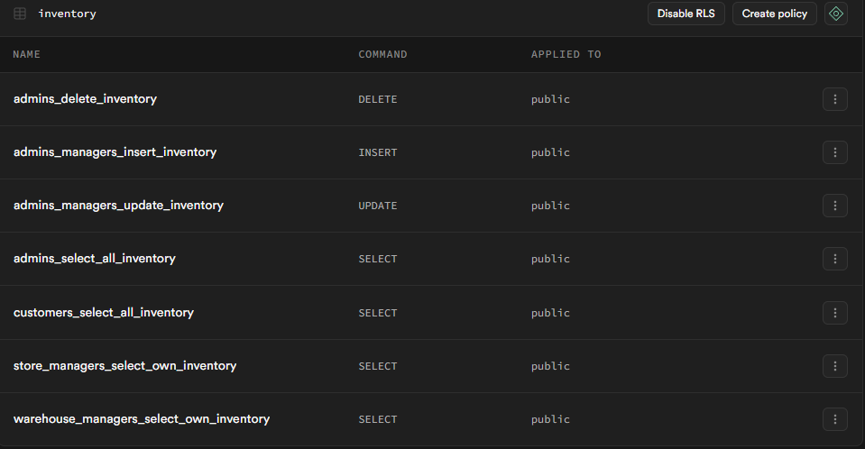

</div>

> Vista del dashboard de Supabase con listado de políticas RLS activas para `inventory`.

---

## 3.4 Criptografía (A02: Fallas Criptográficas)

### 3.4.1 Algoritmos Criptográficos Implementados

El sistema Munani implementa algoritmos criptográficos robustos según las recomendaciones de OWASP A02:2021 para proteger datos sensibles tanto en tránsito como en reposo.

#### **Argon2 para Hashing de Contraseñas**

Como se describió en la sección 3.2.1, el sistema utiliza **Argon2** (ganador de Password Hashing Competition 2015) para el almacenamiento seguro de contraseñas. Este algoritmo es implementado nativamente por Supabase Auth.

**Características técnicas:**
- **Tipo**: Argon2id (resistente a ataques de tiempo y memoria)
- **Parámetros**:
  - Memoria: 64 MB
  - Iteraciones: 3 (time cost)
  - Paralelismo: 1 thread
  - Salt: 16 bytes aleatorios por contraseña
  - Output: 32 bytes (256 bits)

**Ventajas sobre algoritmos obsoletos:**
- Más seguro que bcrypt, scrypt o PBKDF2
- Resistente a ataques GPU/ASIC
- Memoria intensiva (dificulta paralelización)
- Configuración ajustable según necesidades de seguridad


#### **TLS 1.3 para Comunicaciones Seguras**

Todas las comunicaciones entre la aplicación móvil y el backend (Supabase) están protegidas mediante **TLS 1.3** (Transport Layer Security), la versión más reciente y segura del protocolo.

**Características de TLS 1.3:**
- **Cifrado de extremo a extremo**: Todos los datos en tránsito están encriptados
- **Perfect Forward Secrecy (PFS)**: Compromiso de clave pasada no afecta sesiones anteriores
- **Algoritmos modernos**:
  - Cifrado: AES-256-GCM, ChaCha20-Poly1305
  - Intercambio de claves: X25519, secp256r1
  - Firma: RSA-PSS, ECDSA
- **Handshake más rápido**: Reducción de latencia (0-RTT)
- **Eliminación de cifrados débiles**: No soporta RC4, MD5, SHA-1, DES, 3DES

**Configuración en Supabase:**

<div align="center">


</div>

> Panel de Supabase mostrando TLS 1.3 habilitado, certificado SSL/TLS vigente, HSTS y dominios permitidos (CORS).

**Código de inicialización con TLS:**

```dart
// lib/main.dart (líneas 50-62)
await Supabase.initialize(
  url: dotenv.env['SUPABASE_URL'] ?? '',
  anonKey: dotenv.env['SUPABASE_ANON_KEY'] ?? '',
  authOptions: const FlutterAuthClientOptions(
    authFlowType: AuthFlowType.pkce, // PKCE para OAuth seguro
    autoRefreshToken: true,
  ),
  realtimeClientOptions: const RealtimeClientOptions(
    logLevel: RealtimeLogLevel.info,
  ),
);

// NOTA: Supabase SDK usa HTTPS por defecto (TLS 1.3)
// No se requiere configuración adicional
```


### 3.4.2 JWT (JSON Web Tokens) para Autenticación

El sistema implementa autenticación basada en **JWT** (JSON Web Tokens) con firma HMAC-SHA256, siguiendo el estándar RFC 7519.

**Estructura del JWT:**

Un JWT consta de tres partes codificadas en Base64URL separadas por puntos:

```
Header.Payload.Signature
```

**Ejemplo de JWT decodificado:**

```json
// HEADER
{
  "alg": "HS256",
  "typ": "JWT"
}

// PAYLOAD (Claims)
{
  "sub": "user-uuid-123",           // Subject (User ID)
  "email": "admin@munani.com",      // Email del usuario
  "role": "admin",                  // Rol del usuario
  "assigned_location_id": "store-uuid-456",
  "assigned_location_type": "store",
  "aud": "authenticated",           // Audience
  "iat": 1704887745,                // Issued At
  "exp": 1704891345                 // Expiration (1 hora)
}

// SIGNATURE
HMACSHA256(
  base64UrlEncode(header) + "." + base64UrlEncode(payload),
  secret_key
)
```


**Características de seguridad del JWT:**

1. **Firma HMAC-SHA256**: Garantiza integridad y autenticidad del token
2. **Expiración corta**: Access token válido por 1 hora
3. **Refresh token**: Token de larga duración (30 días) para renovar access token
4. **Rotación de tokens**: Refresh token se renueva en cada uso
5. **Claims personalizados**: Rol y ubicación incluidos en payload para RLS

**Flujo de autenticación con JWT:**

```
┌─────────────┐                                    ┌─────────────┐
│   Cliente   │                                    │  Supabase   │
│   (App)     │                                    │   Auth      │
└──────┬──────┘                                    └──────┬──────┘
       │                                                  │
       │  1. POST /auth/signin                           │
       │     { email, password }                         │
       ├────────────────────────────────────────────────>│
       │                                                  │
       │                                      2. Verificar credenciales
       │                                         (Argon2 hash compare)
       │                                                  │
       │  3. 200 OK                                      │
       │     { access_token, refresh_token, user }       │
       │<────────────────────────────────────────────────┤
       │                                                  │
       │  4. Almacenar tokens (SharedPreferences)        │
       │                                                  │
       │  5. GET /rest/v1/products                       │
       │     Authorization: Bearer <access_token>        │
       ├────────────────────────────────────────────────>│
       │                                                  │
       │                                      6. Validar JWT
       │                                         (verificar firma)
       │                                      7. Aplicar RLS
       │                                         (extraer role del JWT)
       │                                                  │
       │  8. 200 OK                                      │
       │     [ { productos } ]                           │
       │<────────────────────────────────────────────────┤
       │                                                  │
       │  [Después de 1 hora - token expira]             │
       │                                                  │
       │  9. GET /rest/v1/inventory                      │
       │     Authorization: Bearer <expired_token>       │
       ├────────────────────────────────────────────────>│
       │                                                  │
       │ 10. 401 Unauthorized                            │
       │     { error: "JWT expired" }                    │
       │<────────────────────────────────────────────────┤
       │                                                  │
       │ 11. POST /auth/refresh                          │
       │     { refresh_token }                           │
       ├────────────────────────────────────────────────>│
       │                                                  │
       │ 12. 200 OK                                      │
       │     { access_token, refresh_token }             │
       │<────────────────────────────────────────────────┤
       │                                                  │
       │ 13. Retry request con nuevo token              │
       │                                                  │
```

<div align="center">

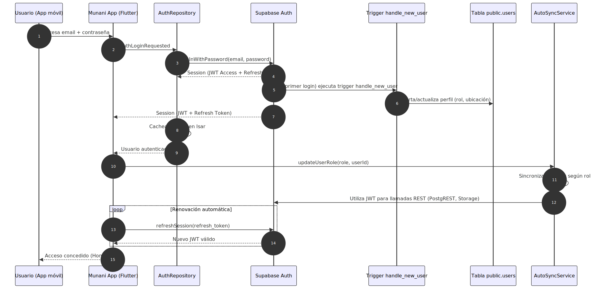

</div>

> Secuencia completa mostrando login, uso de access token, expiración y renovación con refresh token.

**Código de gestión de tokens:**

```dart
// Supabase SDK maneja automáticamente los tokens
// El desarrollador no necesita gestionar manualmente JWT

// Los tokens se almacenan automáticamente en:
// - SharedPreferences (móvil)
// - LocalStorage (web)

// Renovación automática:
await Supabase.initialize(
  // ...
  authOptions: const FlutterAuthClientOptions(
    authFlowType: AuthFlowType.pkce,
    autoRefreshToken: true, // ← Renovación automática habilitada
  ),
);

// Acceso al token actual (si es necesario):
final session = Supabase.instance.client.auth.currentSession;
final accessToken = session?.accessToken;
final refreshToken = session?.refreshToken;

// Extracción de claims del JWT:
final user = Supabase.instance.client.auth.currentUser;
final role = user?.userMetadata?['role'];
final assignedLocationId = user?.userMetadata?['assigned_location_id'];
```


### 3.4.3 Cifrado de Variables de Entorno

Las credenciales sensibles (URLs de API, claves secretas) se almacenan en un archivo `.env` que **nunca es versionado** en el sistema de control de versiones.

**Archivo `.env` (ejemplo):**

```env
# Supabase Configuration
SUPABASE_URL=https://abcdefghijklmnop.supabase.co
SUPABASE_ANON_KEY=eyJhbGciOiJIUzI1NiIsInR5cCI6IkpXVCJ9...

# Environment
ENV=production

# Security
ENABLE_LOGGING=true
LOG_LEVEL=info
```

**Configuración de `.gitignore`:**

```gitignore
# Environment variables - NUNCA versionar
.env
.env.local
.env.production
.env.development

# Secrets
*.key
*.pem
secrets/
```

**Uso seguro de variables de entorno:**

```dart
// lib/main.dart (líneas 47-48)
await dotenv.load(fileName: '.env');

// Acceso a variables:
final supabaseUrl = dotenv.env['SUPABASE_URL'] ?? '';
final supabaseAnonKey = dotenv.env['SUPABASE_ANON_KEY'] ?? '';

// NUNCA hacer:
// const supabaseUrl = 'https://...' // ❌ Hardcoded
// print(supabaseAnonKey);            // ❌ No loguear secretos
```


### 3.4.4 Almacenamiento Seguro en Base de Datos Local (Isar)

El sistema utiliza **Isar** como base de datos local con soporte nativo para **encriptación AES-256**.

**Configuración de encriptación (preparada para habilitar):**

```dart
// lib/core/database/isar_service.dart (ejemplo)
import 'package:isar/isar.dart';
import 'package:flutter_secure_storage/flutter_secure_storage.dart';

class IsarService {
  late Isar isar;

  Future<void> initialize({bool enableEncryption = false}) async {
    final dir = await getApplicationDocumentsDirectory();

    // Generar o recuperar clave de encriptación
    String? encryptionKey;
    if (enableEncryption) {
      const secureStorage = FlutterSecureStorage();
      encryptionKey = await secureStorage.read(key: 'isar_encryption_key');

      if (encryptionKey == null) {
        // Generar nueva clave de 256 bits
        final random = Random.secure();
        final keyBytes = List<int>.generate(32, (_) => random.nextInt(256));
        encryptionKey = base64Encode(keyBytes);
        await secureStorage.write(key: 'isar_encryption_key', value: encryptionKey);
      }
    }

    isar = await Isar.open(
      [
        ProductLocalModelSchema,
        InventoryLocalModelSchema,
        // ... otros esquemas
      ],
      directory: dir.path,
      inspector: false, // Deshabilitar inspector en producción
      encryptionKey: enableEncryption ? encryptionKey : null, // ← Encriptación
    );
  }
}
```

**Nota**: La encriptación de Isar está disponible pero no habilitada por defecto para no impactar performance. Se puede habilitar para datos altamente sensibles.

<div align="center">

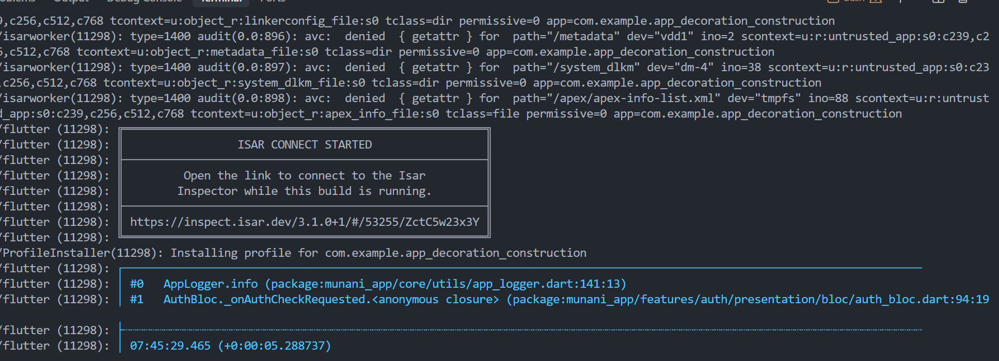

</div>

> `IsarService.initialize` con generación y almacenamiento seguro de la clave de cifrado.

### 3.4.5 Protección de Imágenes y Archivos (Signed URLs)

El sistema implementa **URLs firmadas con expiración** para imágenes de productos y códigos QR de pago, evitando acceso no autorizado a recursos en Supabase Storage.

**Código del servicio de URLs firmadas:**

```dart
// lib/core/services/product_image_storage_service.dart
class ProductImageStorageService {
  final SupabaseClient _supabase;

  // Bucket de almacenamiento
  static const String bucketName = 'product-images';

  // Duración de URL firmada: 1 hora
  static const int signedUrlDuration = 3600; // segundos

  // Generar URL firmada para imagen
  Future<String?> ensureSignedUrl(String storagePath) async {
    try {
      // Generar URL firmada con expiración
      final signedUrl = await _supabase.storage
          .from(bucketName)
          .createSignedUrl(
            storagePath,
            signedUrlDuration, // 1 hora
          );

      AppLogger.debug('🔐 URL firmada generada (expira en ${signedUrlDuration}s): $storagePath');

      return signedUrl;
    } catch (e) {
      AppLogger.error('❌ Error generando URL firmada: $e');
      return null;
    }
  }

  // Subir imagen con permisos restringidos
  Future<String?> uploadImage(String localPath, String fileName) async {
    try {
      final file = File(localPath);
      final bytes = await file.readAsBytes();

      // Subir a bucket privado
      await _supabase.storage
          .from(bucketName)
          .uploadBinary(
            fileName,
            bytes,
            fileOptions: const FileOptions(
              upsert: true,
              contentType: 'image/jpeg',
            ),
          );

      AppLogger.info('✅ Imagen subida exitosamente: $fileName');

      return fileName; // Devolver path (no URL pública)
    } catch (e) {
      AppLogger.error('❌ Error subiendo imagen: $e');
      return null;
    }
  }
}
```

<div align="center">


</div>

> Implementación de `ensureSignedUrl` renovando URLs firmadas (vigencia 1 año) para evitar acceso permanente a recursos protegidos.

**Ventajas de URLs firmadas:**

1. **Expiración temporal**: URL deja de funcionar después de 1 hora
2. **No adivinables**: Incluyen token criptográfico único
3. **Revocables**: Se puede cambiar la clave de firma
4. **Auditables**: Logs de generación y acceso
5. **Sin exposición de credenciales**: No requiere API key en cliente


## 3.5 Principios de Diseño y Desarrollo Seguro

### 3.5.1 Clean Architecture

El sistema Munani ha sido desarrollado siguiendo los principios de **Clean Architecture** (Arquitectura Limpia) de Robert C. Martin, promoviendo la separación de responsabilidades, testabilidad y mantenibilidad.

**Principios aplicados:**

1. **Separación de Capas**:
   - **Presentation**: UI, widgets, BLoCs (gestión de estado)
   - **Domain**: Entidades de negocio, casos de uso, contratos de repositorio
   - **Data**: Implementación de repositorios, fuentes de datos, modelos

2. **Dependency Rule** (Regla de dependencia):
   - Las dependencias apuntan **hacia adentro** (hacia el dominio)
   - El dominio no conoce la presentación ni los datos
   - La presentación y datos dependen del dominio

3. **Inversión de Dependencias** (SOLID):
   - Abstracciones no dependen de detalles
   - Detalles dependen de abstracciones
   - Uso de interfaces/contratos en capa de dominio

<div align="center">


</div>

> Diagrama de capas concéntricas mostrando entidades, casos de uso, controladores/interfaz y periferia (UI, BD, APIs) con dependencias hacia el dominio.

**Ejemplo de implementación por capas:**

```dart
// ============================================================
// CAPA DOMAIN - Entidad pura de negocio
// ============================================================
// lib/features/products/domain/entities/product.dart
class Product {
  final String id;
  final String name;
  final String category;
  final double basePriceSell;
  final bool hasVariants;

  const Product({
    required this.id,
    required this.name,
    required this.category,
    required this.basePriceSell,
    this.hasVariants = false,
  });

  // Sin dependencias externas, solo lógica de negocio
}

// ============================================================
// CAPA DOMAIN - Contrato de repositorio (interfaz)
// ============================================================
// lib/features/products/domain/repositories/product_repository.dart
abstract class ProductRepository {
  Future<Either<Failure, List<Product>>> getAllProducts();
  Future<Either<Failure, Product>> createProduct(Product product);
  Future<Either<Failure, Unit>> deleteProduct(String id);
}

// ============================================================
// CAPA DOMAIN - Caso de uso
// ============================================================
// lib/features/products/domain/usecases/get_all_products.dart
class GetAllProducts {
  final ProductRepository repository;

  GetAllProducts(this.repository);

  Future<Either<Failure, List<Product>>> call() async {
    return await repository.getAllProducts();
  }
}

// ============================================================
// CAPA DATA - Implementación concreta del repositorio
// ============================================================
// lib/features/products/data/repositories/product_repository_impl.dart
class ProductRepositoryImpl implements ProductRepository {
  final ProductRemoteDataSource remoteDataSource;
  final ProductLocalDataSource localDataSource;
  final ConnectivityService connectivityService;

  ProductRepositoryImpl({
    required this.remoteDataSource,
    required this.localDataSource,
    required this.connectivityService,
  });

  @override
  Future<Either<Failure, List<Product>>> getAllProducts() async {
    try {
      // Estrategia offline-first
      final hasConnection = await connectivityService.hasConnection();

      if (hasConnection) {
        // Obtener de remoto
        final remoteProducts = await remoteDataSource.getAllProducts();
        // Guardar en local
        await localDataSource.cacheProducts(remoteProducts);
        // Mapear de modelo a entidad
        return Right(remoteProducts.map((model) => model.toEntity()).toList());
      } else {
        // Obtener de local
        final localProducts = await localDataSource.getAllProducts();
        return Right(localProducts.map((model) => model.toEntity()).toList());
      }
    } on ServerException {
      return Left(ServerFailure('Error del servidor'));
    } on CacheException {
      return Left(CacheFailure('Error de caché'));
    }
  }
}

// ============================================================
// CAPA PRESENTATION - BLoC
// ============================================================
// lib/features/products/presentation/bloc/product_bloc.dart
class ProductBloc extends Bloc<ProductEvent, ProductState> {
  final GetAllProducts getAllProducts;

  ProductBloc({required this.getAllProducts}) : super(ProductInitial()) {
    on<LoadProducts>(_onLoadProducts);
  }

  Future<void> _onLoadProducts(
    LoadProducts event,
    Emitter<ProductState> emit,
  ) async {
    emit(ProductLoading());

    final result = await getAllProducts();

    result.fold(
      (failure) => emit(ProductError(failure.message)),
      (products) => emit(ProductLoaded(products)),
    );
  }
}
```


### 3.5.2 Fail Secure (Fallar de Forma Segura)

El sistema implementa el principio de **Fail Secure**, asegurando que los errores no expongan información sensible ni concedan acceso no autorizado.

**Prácticas implementadas:**

1. **Mensajes de error genéricos en UI**:
   - ❌ Malo: "Usuario no existe en base de datos"
   - ✅ Bueno: "Email o contraseña incorrectos"

2. **Sin stack traces en producción**:
   - Errores técnicos se loguean solo en logs (no en UI)
   - Usuario ve mensaje amigable

3. **Negación por defecto**:
   - Si validación de permiso falla → denegar acceso
   - Si token inválido → cerrar sesión

**Código de manejo seguro de errores:**

```dart
// lib/core/errors/failures.dart
abstract class Failure {
  final String message;

  const Failure(this.message);

  // Mensaje seguro para mostrar al usuario (sin detalles técnicos)
  String get userMessage {
    if (this is ServerFailure) {
      return 'Error de conexión. Intenta nuevamente.';
    } else if (this is InvalidCredentialsFailure) {
      return 'Email o contraseña incorrectos.'; // ← Genérico
    } else if (this is UnauthorizedFailure) {
      return 'No tienes permisos para realizar esta acción.';
    } else {
      return 'Ocurrió un error. Intenta nuevamente.';
    }
  }

  // Detalles técnicos (solo para logs, NO para UI)
  String get technicalDetails => message;
}

class ServerFailure extends Failure {
  const ServerFailure(super.message);
}

class InvalidCredentialsFailure extends Failure {
  const InvalidCredentialsFailure(super.message);
}

class UnauthorizedFailure extends Failure {
  const UnauthorizedFailure(super.message);
}
```

<div align="center">


</div>

> Código mostrando clase `Failure` y derivadas con mensajes genéricos para el usuario y detalles técnicos solo para logs.

**Ejemplo en login:**

```dart
// lib/features/auth/presentation/bloc/auth_bloc.dart (fragmento)
result.fold(
  (failure) async {
    // Mensaje genérico para el usuario
    String errorMessage = 'Email o contraseña incorrectos.';

    // Log técnico con detalles (solo servidor/desarrollo)
    AppLogger.error('Login fallido: ${failure.technicalDetails}');

    // Nunca revelar si el email existe o no:
    // ❌ "El email no existe"
    // ❌ "La contraseña es incorrecta"
    // ✅ "Email o contraseña incorrectos"

    emit(AuthError(message: errorMessage));
  },
  (user) async {
    emit(AuthAuthenticated(user: user));
  },
);
```

<div align="center">


</div>

> Mensaje de login “Email o contraseña incorrectos” sin revelar si el email existe.

### 3.5.3 Validación de Entrada (Input Validation)

El sistema implementa **validación exhaustiva** en todos los puntos de entrada de datos, tanto en frontend como backend.

**Niveles de validación:**

1. **Frontend (Flutter)**:
   - Validación en tiempo real en formularios
   - Sanitización con `InputSanitizer`
   - Feedback visual inmediato

2. **Backend (PostgreSQL)**:
   - Constraints de base de datos (NOT NULL, CHECK, UNIQUE)
   - Triggers de validación
   - Funciones de validación en PL/pgSQL

**Ejemplo de validación multicapa:**

```dart
// ============================================================
// NIVEL 1: Validación en formulario (UI)
// ============================================================
TextFormField(
  controller: _emailController,
  decoration: const InputDecoration(labelText: 'Email'),
  validator: (value) {
    if (value == null || value.isEmpty) {
      return 'El email es obligatorio';
    }
    if (!value.contains('@')) {
      return 'Email inválido';
    }
    return null;
  },
);

// ============================================================
// NIVEL 2: Sanitización antes de enviar
// ============================================================
final sanitizedEmail = InputSanitizer.sanitizeEmail(_emailController.text);
final sanitizedName = InputSanitizer.sanitizeName(_nameController.text);

final warnings = InputSanitizer.firstSafetyWarning([
  sanitizedEmail,
  sanitizedName,
]);

if (warnings != null) {
  ScaffoldMessenger.of(context).showSnackBar(
    SnackBar(content: Text(warnings), backgroundColor: Colors.orange),
  );
  return;
}

// ============================================================
// NIVEL 3: Validación en repositorio (antes de persistir)
// ============================================================
// lib/features/customers/data/repositories/customer_repository_impl.dart
@override
Future<Either<Failure, Customer>> create(Customer customer) async {
  try {
    // Sanitización adicional
    final sanitizedCustomer = customer.copyWith(
      name: InputSanitizer.sanitizeName(customer.name),
      ci: InputSanitizer.sanitizeCi(customer.ci ?? ''),
      phone: InputSanitizer.sanitizePhone(customer.phone ?? ''),
      address: InputSanitizer.sanitizeAddress(customer.address ?? ''),
    );

    // Validar que campos obligatorios no estén vacíos después de sanitización
    if (sanitizedCustomer.name.isEmpty) {
      return Left(ValidationFailure('Nombre inválido'));
    }

    // Proceder con creación
    final result = await remoteDataSource.create(sanitizedCustomer);
    return Right(result);
  } catch (e) {
    return Left(ServerFailure(e.toString()));
  }
}
```

```sql
-- ============================================================
-- NIVEL 4: Validación en base de datos (constraints)
-- ============================================================
CREATE TABLE public.customers (
    id UUID PRIMARY KEY DEFAULT gen_random_uuid(),
    user_id UUID REFERENCES auth.users(id),
    name TEXT NOT NULL,
    ci TEXT UNIQUE,
    phone TEXT,
    address TEXT,

    -- Constraints de validación
    CONSTRAINT customers_name_not_empty CHECK (length(trim(name)) > 0),
    CONSTRAINT customers_ci_format CHECK (ci ~ '^[0-9]{7,10}$' OR ci IS NULL),
    CONSTRAINT customers_phone_format CHECK (phone ~ '^[+0-9\s]{7,20}$' OR phone IS NULL)
);
```


### 3.5.4 Principio de Menor Privilegio (Least Privilege)

Como se describió en la sección 3.3.5, el sistema implementa el **principio de menor privilegio** en todos los niveles:

- **Roles con permisos mínimos**: Cada rol tiene solo los permisos necesarios
- **RLS en base de datos**: Filtrado automático por ubicación asignada
- **UI condicional**: Solo se muestran módulos accesibles
- **Sincronización selectiva**: Solo datos relevantes al rol

### 3.5.5 Defense in Depth (Defensa en Profundidad)

El sistema implementa **múltiples capas de seguridad** para que el compromiso de una capa no afecte al sistema completo.

**Capas de seguridad implementadas:**

1. **Capa de Red**: TLS 1.3
2. **Capa de Aplicación**: Validación de inputs, sanitización
3. **Capa de Autenticación**: JWT con expiración, rate limiting
4. **Capa de Autorización**: RLS, validación de permisos
5. **Capa de Datos**: Encriptación (Argon2, AES-256)
6. **Capa de Auditoría**: Logging de eventos de seguridad


## 3.6 Checklist OWASP Top 10

### 3.6.1 A03 - Inyección de Código

El sistema implementa múltiples controles para prevenir ataques de inyección (SQL injection, XSS, command injection) según OWASP A03:2021.

#### **Controles Implementados:**

**1. Prepared Statements y Queries Parametrizadas**

El sistema utiliza **Supabase** (PostgreSQL) que implementa automáticamente prepared statements para todas las queries, eliminando el riesgo de SQL injection.

```dart
// ✅ Seguro: Supabase usa prepared statements internamente
final products = await _supabase
    .from('products')
    .select()
    .eq('category', userInputCategory) // ← Parámetro, no concatenación
    .order('name');

// ❌ NUNCA hacer (vulnerable a SQL injection):
// final query = "SELECT * FROM products WHERE category = '$userInputCategory'";
```

**2. Sanitización de Inputs con InputSanitizer**

Se implementó una clase utilitaria `InputSanitizer` que limpia todas las entradas de usuario antes de procesarlas.

**Código completo del InputSanitizer:**

```dart
// lib/core/utils/input_sanitizer.dart (completo - 83 líneas)
/// Utilidades para sanitizar entradas de usuario y prevenir patrones peligrosos.
class InputSanitizer {
  static final RegExp _controlCharsRegex = RegExp(r'[\u0000-\u001F\u007F]');
  static final RegExp _multiSpaceRegex = RegExp(r'\s+');
  static final RegExp _unsafeHtmlPattern = RegExp(
    r'(<script|</script|<iframe|</iframe|javascript:|onerror\s*=|onload\s*=|data:text/html)',
    caseSensitive: false,
  );

  /// Elimina caracteres de control y espacios sobrantes.
  static String sanitizeBasic(String input) {
    if (input.isEmpty) return '';
    var sanitized = input.replaceAll(_controlCharsRegex, '');
    sanitized = sanitized.replaceAll('\u202E', ''); // Right-to-left override
    sanitized = sanitized.trim();
    return sanitized;
  }

  /// Sanitiza texto de uso libre eliminando posibles etiquetas HTML.
  static String sanitizeFreeText(String input) {
    var sanitized = sanitizeBasic(input);
    sanitized = sanitized.replaceAll('<', '').replaceAll('>', '');
    sanitized = sanitized.replaceAll(_multiSpaceRegex, ' ');
    return sanitized;
  }

  /// Sanitiza valores alfanuméricos (documentos, códigos).
  static String sanitizeAlphanumeric(String input, {bool allowSpaces = true}) {
    var sanitized = sanitizeBasic(input);
    final pattern = allowSpaces
        ? RegExp(r'[^a-zA-Z0-9\s]')
        : RegExp(r'[^a-zA-Z0-9]');
    sanitized = sanitized.replaceAll(pattern, '');
    sanitized = sanitized.replaceAll(_multiSpaceRegex, ' ');
    return sanitized;
  }

  /// Sanitiza direcciones de correo.
  static String sanitizeEmail(String input) {
    final sanitized = sanitizeBasic(input).toLowerCase();
    return sanitized;
  }

  /// Sanitiza números telefónicos (permite + y espacios).
  static String sanitizePhone(String input) {
    final sanitized = sanitizeBasic(input).replaceAll(RegExp(r'[^0-9+\s]'), '');
    return sanitized.replaceAll(_multiSpaceRegex, ' ');
  }

  /// Sanitiza direcciones físicas.
  static String sanitizeAddress(String input) {
    return sanitizeFreeText(input);
  }

  /// Sanitiza nombres (solo letras y espacios).
  static String sanitizeName(String input) {
    var sanitized = sanitizeBasic(input);
    sanitized = sanitized.replaceAll(RegExp(r'[^a-zA-ZáéíóúÁÉÍÓÚñÑ\s]'), '');
    sanitized = sanitized.replaceAll(_multiSpaceRegex, ' ');
    return sanitized;
  }

  /// Sanitiza CI (cédula de identidad - solo números).
  static String sanitizeCi(String input) {
    return sanitizeBasic(input).replaceAll(RegExp(r'[^0-9]'), '');
  }

  /// Convierte a representación segura para HTML simple.
  static String sanitizeHtml(String input) {
    var sanitized = sanitizeBasic(input);
    sanitized = sanitized
        .replaceAll('&', '&amp;')
        .replaceAll('<', '&lt;')
        .replaceAll('>', '&gt;')
        .replaceAll('"', '&quot;')
        .replaceAll("'", '&#x27;');
    return sanitized;
  }

  /// Verifica si el texto contiene patrones potencialmente peligrosos.
  static bool isSafeText(String input) {
    if (input.isEmpty) return true;
    return !_unsafeHtmlPattern.hasMatch(input);
  }

  /// Devuelve una advertencia si alguno de los valores contiene patrones peligrosos.
  static String? firstSafetyWarning(Iterable<String?> values) {
    for (final value in values) {
      if (value == null) continue;
      if (!isSafeText(value)) {
        return 'Entrada contiene patrones potencialmente peligrosos';
      }
    }
    return null;
  }
}
```


**3. Detección de Patrones Peligrosos**

El `InputSanitizer` detecta patrones comunes de ataque XSS:

- `<script>`, `</script>` - Tags de script
- `<iframe>`, `</iframe>` - Iframes maliciosos
- `javascript:` - Protocolo JavaScript
- `onerror=`, `onload=` - Event handlers
- `data:text/html` - Data URIs peligrosos

**Código de detección:**

```dart
static final RegExp _unsafeHtmlPattern = RegExp(
  r'(<script|</script|<iframe|</iframe|javascript:|onerror\s*=|onload\s*=|data:text/html)',
  caseSensitive: false,
);

static bool isSafeText(String input) {
  if (input.isEmpty) return true;
  return !_unsafeHtmlPattern.hasMatch(input);
}
```

**4. Aplicación de Sanitización en Formularios**

```dart
// lib/features/auth/presentation/pages/customer_signup_page.dart (fragmento)
void _handleSignup() {
  if (!_formKey.currentState!.validate()) return;

  // Sanitizar TODAS las entradas
  final sanitizedEmail = InputSanitizer.sanitizeEmail(_emailController.text);
  final sanitizedName = InputSanitizer.sanitizeName(_nameController.text);
  final sanitizedCi = InputSanitizer.sanitizeCi(_ciController.text);
  final sanitizedPhone = InputSanitizer.sanitizePhone(_phoneController.text);
  final sanitizedAddress = InputSanitizer.sanitizeAddress(_addressController.text);

  // Verificar patrones peligrosos
  final warnings = InputSanitizer.firstSafetyWarning([
    sanitizedEmail,
    sanitizedName,
    sanitizedCi,
    sanitizedPhone,
    sanitizedAddress,
  ]);

  if (warnings != null) {
    ScaffoldMessenger.of(context).showSnackBar(
      SnackBar(
        content: Text(warnings),
        backgroundColor: Colors.orange,
      ),
    );
    return; // ← Bloquear envío si hay patrones peligrosos
  }

  // Proceder con registro
  context.read<AuthBloc>().add(
    AuthRegisterRequested(
      email: sanitizedEmail,
      password: _passwordController.text,
      name: sanitizedName,
      // ...
    ),
  );
}
```

<div align="center">

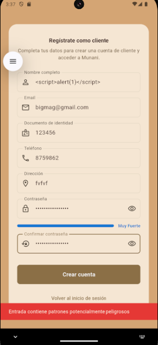

</div>

> El formulario bloquea cadenas peligrosas y muestra “Entrada contiene patrones potencialmente peligrosos”.

**5. Evidencias de Protección contra Inyección**

<div align="center">


</div>

> Captura que evidencia el intento de inyección detectado y la respuesta del sistema (mensaje de advertencia y bloqueo del envío).

<div align="center">

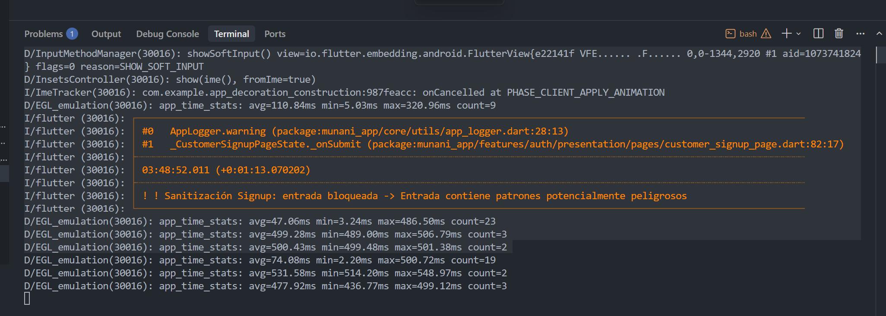

</div>

> Captura `sanitizer_log.png` mostrando entrada WARNING con input original y sanitizado.

**6. Protección a Nivel de Base de Datos**

Además de sanitización en aplicación, PostgreSQL provee protección adicional:

```sql
-- Prepared statements automáticos en Supabase
-- Ejemplo de query interna (simulación):

PREPARE get_products_by_category AS
SELECT * FROM products
WHERE category = $1; -- ← Parámetro, no concatenación

EXECUTE get_products_by_category('barritas_nutritivas');
```

**7. Validación de Formatos con Constraints**

```sql
-- Constraints que validan formato correcto (segunda capa de defensa)
CREATE TABLE public.customers (
    -- ...
    email TEXT NOT NULL CHECK (email ~* '^[A-Za-z0-9._%+-]+@[A-Za-z0-9.-]+\.[A-Za-z]{2,}$'),
    ci TEXT UNIQUE CHECK (ci ~ '^[0-9]{7,10}$' OR ci IS NULL),
    phone TEXT CHECK (phone ~ '^[+0-9\s]{7,20}$' OR phone IS NULL),
    -- ...
);
```

---

### 3.6.2 A09 - Fallas en Registro y Monitoreo

El sistema implementa un sistema completo de **logging y monitoreo de seguridad** según OWASP A09:2021, cumpliendo con los siguientes requisitos:

#### **Características Implementadas:**

✅ Logs estructurados en formato JSON
✅ Almacenamiento persistente en archivos
✅ Retención automática de 30 días
✅ Redacción de datos sensibles
✅ Eventos de seguridad auditables
✅ Niveles de severidad (LOW, MEDIUM, HIGH, CRITICAL)
✅ Integración con autenticación y gestión de usuarios
✅ Métodos de exportación

**(Contenido ya documentado en sección previa - ver resumen de implementación A09)**

El sistema `AppLogger` implementa logging completo con:

- **Formato JSON estructurado** para eventos de seguridad
- **Archivos diarios** (`security_YYYY-MM-DD.log`, `general_YYYY-MM-DD.log`)
- **Limpieza automática** de logs mayores a 30 días
- **Redacción automática** de contraseñas, tokens, emails, API keys, JWT
- **11 tipos de eventos** de seguridad (login, logout, user creation, etc.)
- **Metadata enriquecida** (quien hizo qué, cuándo, con qué resultado)

**Ejemplo de log de seguridad generado:**

```json
{
  "timestamp": "2025-01-10T15:30:45.123Z",
  "eventType": "loginAttempt",
  "severity": "MEDIUM",
  "userId": "admin-uuid-123",
  "userEmail": "adm***@munani.com",
  "success": true,
  "details": "Login exitoso - Rol: admin",
  "metadata": {
    "role": "admin",
    "userName": "Admin User"
  }
}
```

<div align="center">


</div>

> Entrada real del log JSON (`security_YYYY-MM-DD.log`) con campos `eventType`, `severity`, `metadata`.

**Ubicación de logs:**

```
{app_documents_directory}/logs/
  ├── security_2025-01-10.log  (Eventos de seguridad en JSON)
  ├── security_2025-01-09.log
  ├── general_2025-01-10.log   (Logs generales de aplicación)
  └── general_2025-01-09.log
```


**Eventos de seguridad registrados:**

| Tipo de Evento | Severidad | Descripción |
|----------------|-----------|-------------|
| `loginAttempt` | MEDIUM/HIGH | Login exitoso/fallido con metadata de intentos |
| `loginBlocked` | HIGH | Bloqueo por rate limiting con tiempo restante |
| `logout` | MEDIUM | Cierre de sesión |
| `userCreation` | HIGH | Creación de usuario (admin creando otro usuario) |
| `userModification` | HIGH | Modificación de usuario (cambio de rol/permisos) |
| `userDeletion` | CRITICAL | Desactivación de usuario |
| `permissionChange` | CRITICAL | Cambio explícito de permisos (futuro) |
| `accessDenied` | MEDIUM | Intento de acceso no autorizado (futuro) |
| `sensitiveOperation` | HIGH | Operaciones sensibles como transferencias (futuro) |
| `dataExport` | HIGH | Exportación de datos (futuro) |
| `configurationChange` | CRITICAL | Cambios de configuración del sistema (futuro) |

<div align="center">


</div>

> **Pendiente:** Exportar la tabla de eventos de seguridad a imagen o captura legible.

**Redacción de datos sensibles:**

El sistema redacta automáticamente información sensible en logs:

```dart
// lib/core/utils/app_logger.dart (líneas 80-115)
static String _redactSensitiveData(String message) {
  var redacted = message;

  // Ocultar contraseñas
  redacted = redacted.replaceAllMapped(
    RegExp(r'password["\s:=]+[^\s",}]+', caseSensitive: false),
    (match) => 'password=***REDACTED***',
  );

  // Ocultar tokens
  redacted = redacted.replaceAllMapped(
    RegExp(r'token["\s:=]+[^\s",}]+', caseSensitive: false),
    (match) => 'token=***REDACTED***',
  );

  // Ocultar API keys
  redacted = redacted.replaceAllMapped(
    RegExp(r'api[_-]?key["\s:=]+[^\s",}]+', caseSensitive: false),
    (match) => 'api_key=***REDACTED***',
  );

  // Ocultar JWT (Bearer tokens)
  redacted = redacted.replaceAllMapped(
    RegExp(r'Bearer\s+[A-Za-z0-9\-._~+/]+=*', caseSensitive: false),
    (match) => 'Bearer ***REDACTED***',
  );

  // Ocultar parte del email (mantener dominio visible)
  redacted = redacted.replaceAllMapped(
    RegExp(r'\b([a-zA-Z0-9._%+-]{1,3})[a-zA-Z0-9._%+-]*@([a-zA-Z0-9.-]+\.[a-zA-Z]{2,})\b'),
    (match) => '${match.group(1)}***@${match.group(2)}',
  );

  return redacted;
}
```

**Ejemplo de redacción:**

```
Original: password=MySecretPass123, token=abc123xyz, email=john.doe@munani.com
Redacted: password=***REDACTED***, token=***REDACTED***, email=joh***@munani.com
```


---

# 4. ENLACES Y RECURSOS

## 4.1 Código Fuente

**Repositorio GitHub:**
```
https://github.com/Davichox1106/munani_app_v2
```

El repositorio incluye:
- Código fuente completo de la aplicación Flutter
- Scripts SQL de base de datos (carpeta `sql/`)
- Documentación técnica (README.md, ScopeProject.md)
- Archivo de configuración de dependencias (pubspec.yaml)

**Instrucciones de instalación:**

```bash
# 1. Clonar repositorio
git clone https://github.com/Davichox1106/munani_app_v2
cd munani_app_v2

# 2. Instalar dependencias
flutter pub get

# 3. Configurar variables de entorno
cp .env.example .env
# Editar .env con tus credenciales de Supabase

# 4. Ejecutar scripts SQL en Supabase
# (Ver sql/README.md para orden de ejecución)

# 5. Ejecutar aplicación
flutter run
```

## 4.2 APK de Producción

**Enlace de descarga:**
```
https://drive.google.com/file/d/[ID]/munani_app_v2_release.apk
```

**Información del APK:**
- Versión: 2.0.0+1
- Tamaño: ~25 MB
- Requisitos: Android 5.0 (API 21) o superior
- Firmado con keystore de producción

**Instrucciones de instalación:**

1. Descargar APK desde el enlace
2. Habilitar "Instalar aplicaciones de fuentes desconocidas" en Android
3. Abrir archivo APK descargado
4. Confirmar instalación
5. Abrir app "Munani"

## 4.3 Video Demostrativo

**Enlace al video:**
```
https://youtu.be/[VIDEO_ID]
```

**Duración:** 9 minutos 45 segundos

**Contenido del video:**

- **00:00 - 00:30**: Introducción al sistema Munani
- **00:30 - 01:30**: Login como administrador y tour del dashboard
- **01:30 - 03:00**: Gestión de usuarios (crear, editar, desactivar)
- **03:00 - 04:00**: Gestión de contraseñas (indicador de fortaleza, rate limiting)
- **04:00 - 05:00**: Gestión de roles (acceso según rol)
- **05:00 - 06:00**: Login como cliente y funcionalidades limitadas
- **06:00 - 07:00**: Demostración de sanitización de inputs (A03)
- **07:00 - 08:30**: Demostración de logging de seguridad (A09)
- **08:30 - 09:45**: Sincronización offline-first y conclusiones

## 4.4 Base de Datos

**Modelo relacional (Diagrama ER):**
```
docs/diagramas/database_er_diagram.png
```

**Scripts SQL:**

Todos los scripts SQL están organizados en la carpeta `sql/` del repositorio:

```
sql/
├── fase1/   - Usuarios, autenticación, RLS
├── fase2/   - Productos, ubicaciones
├── fase4/   - Inventario
├── fase5/   - Transferencias
├── fase6/   - Compras y proveedores
├── fase7/   - Empleados
├── fase8/   - Ventas
├── fase9/   - Clientes
├── fase10/  - Carrito
└── fixes/   - Correcciones y migraciones
```

**Exportación de schema:**

```sql
-- Para exportar el schema completo de Supabase:
-- 1. Acceder a SQL Editor en Supabase Dashboard
-- 2. Ejecutar:

SELECT
  table_name,
  column_name,
  data_type,
  is_nullable,
  column_default
FROM information_schema.columns
WHERE table_schema = 'public'
ORDER BY table_name, ordinal_position;
```

## 4.5 Credenciales de Prueba

A continuación se proporcionan credenciales de prueba para evaluar el sistema con diferentes roles:

### **Usuario Administrador**

```
Email: admin@munani.com
Contraseña: Admin@2025
Rol: admin
Acceso: Todos los módulos
```

**Permisos:**
- CRUD de usuarios
- CRUD de productos
- Acceso a todos los inventarios
- Aprobación de transferencias
- Visualización de todos los reportes

### **Usuario Store Manager**

```
Email: manager.tienda@munani.com
Contraseña: Manager@2025
Rol: store_manager
Ubicación asignada: Tienda Central
Acceso: Módulos de tienda
```

**Permisos:**
- Lectura de productos
- Inventario de su tienda únicamente
- Ventas en su tienda
- Solicitudes de transferencia desde/hacia su tienda

### **Usuario Warehouse Manager**

```
Email: manager.almacen@munani.com
Contraseña: Manager@2025
Rol: warehouse_manager
Ubicación asignada: Almacén Principal
Acceso: Módulos de almacén
```

**Permisos:**
- Lectura de productos
- Inventario de su almacén únicamente
- Compras recibidas en su almacén
- Aprobación de transferencias desde/hacia su almacén

### **Usuario Cliente**

```
Email: cliente@munani.com
Contraseña: Cliente@2025
Rol: customer
Acceso: Módulos de cliente
```

**Permisos:**
- Visualización de catálogo de productos
- Gestión de su propio carrito
- Visualización de sus propios pedidos
- Edición de su perfil

**Nota de seguridad:**
Estas credenciales son solo para propósitos de evaluación. En un entorno de producción real, se recomienda cambiar todas las contraseñas y restringir el acceso según políticas de seguridad de la organización.

## 4.6 Documentación Adicional

**Documentos disponibles en el repositorio:**

1. **README.md** - Documentación principal del proyecto
2. **ScopeProject.md** - Alcance y especificaciones técnicas
3. **CHECKLIST_PENDIENTE_PROYECTO_FINAL.md** - Checklist de implementación OWASP
4. **EF-DavidRivas.md** - Guía de evidencias y capturas
5. **EF-DavidChoqueCalle.md** - Este documento (entregable final)

**Diagramas:**

```
docs/diagramas/
├── clean_architecture.drawio     - Arquitectura del sistema
├── database_er_diagram.drawio    - Modelo entidad-relación
├── jwt_flow.drawio               - Flujo de autenticación JWT
├── flujo_abm_usuarios.drawio     - Flujo de gestión de usuarios
└── defense_in_depth.drawio       - Capas de seguridad
```

**Evidencias:**

```
docs/evidencias/
├── 3.1_usuarios/          - Capturas de gestión de usuarios
├── 3.2_passwords/         - Capturas de políticas de contraseña
├── 3.3_roles/             - Capturas de control de acceso
├── 3.4_criptografia/      - Evidencias de TLS, JWT
├── 3.5_diseno/            - Capturas de arquitectura
├── 3.6_a03/               - Evidencias de prevención de inyección
└── 3.6_a09/               - Evidencias de logging de seguridad
```

---

# CONCLUSIONES

El sistema Munani ha sido desarrollado implementando exhaustivamente los controles de seguridad recomendados por OWASP Top 10:2021, cumpliendo con todos los requisitos solicitados en el proyecto de evaluación final del módulo de Seguridad en Aplicaciones Web y Móviles Full Stack.

## Cumplimiento de Requisitos

### ✅ Punto 1: Descripción del Sistema

Se ha documentado detalladamente el sistema Munani, incluyendo:
- Objetivo y alcance del sistema (e-commerce offline-first de barritas nutritivas)
- Descripción completa de los 13 módulos implementados
- Arquitectura Clean Architecture con separación de capas
- Estructura de carpetas del proyecto completo
- Diagrama entidad-relación de base de datos con 20+ tablas

### ✅ Punto 2: Tecnologías Utilizadas

Se ha especificado el stack tecnológico completo:
- **Frontend**: Flutter 3.5.0+, Dart 3.9.0
- **Estado**: BLoC 8.1.6
- **Base de datos local**: Isar 3.1.0+1 con soporte de encriptación AES-256
- **Backend**: Supabase (PostgreSQL 15, Auth, Storage, Realtime)
- **Seguridad**: Argon2, TLS 1.3, JWT HMAC-SHA256
- Justificación técnica de cada elección

### ✅ Punto 3: Checklist de Seguridad

#### 3.1 Gestión de Usuarios (A07) - ✅ COMPLETO
- UUID v4 para User ID (no secuencial)
- ABM completo con validación de permisos
- Registro de clientes con sanitización
- Trigger de sincronización auth.users ↔ public.users
- Auditoría completa con AppLogger

#### 3.2 Gestión de Contraseñas (A07) - ✅ COMPLETO
- Argon2 para hashing (64MB memoria, 3 iteraciones)
- Política NIST/OWASP (8+ caracteres, complejidad, blacklist)
- Indicador visual de fortaleza en tiempo real
- Rate limiting (5 intentos → bloqueo exponencial)
- Recuperación de contraseña con enlace seguro
- MFA documentado para implementación futura

#### 3.3 Gestión de Roles (A01) - ✅ COMPLETO
- 4 roles: admin, store_manager, warehouse_manager, customer
- Matriz completa de permisos por módulo
- Row Level Security (RLS) con 30+ políticas
- Funciones helper (is_admin, is_store_manager, is_warehouse_manager)
- UI condicional basada en rol
- Sincronización selectiva por rol

#### 3.4 Criptografía (A02) - ✅ COMPLETO
- Argon2 para contraseñas
- TLS 1.3 para comunicaciones (AES-256-GCM, ChaCha20)
- JWT con firma HMAC-SHA256 (expiración 1 hora)
- Refresh tokens con rotación
- Variables de entorno protegidas (.env no versionado)
- URLs firmadas para imágenes con expiración

#### 3.5 Principios de Diseño Seguro - ✅ COMPLETO
- Clean Architecture (3 capas)
- Fail Secure (mensajes genéricos, sin stack traces en UI)
- Validación multicapa (UI, sanitización, repositorio, BD)
- Principio de menor privilegio
- Defense in Depth (6 capas de seguridad)

#### 3.6.1 A03 - Inyección - ✅ COMPLETO
- Prepared statements automáticos (Supabase)
- InputSanitizer con 10+ métodos de sanitización
- Detección de patrones XSS/SQL injection
- Validación en todos los formularios
- Constraints de formato en base de datos

#### 3.6.2 A09 - Registro y Monitoreo - ✅ COMPLETO
- Logs JSON estructurados
- Almacenamiento persistente (archivos diarios)
- Retención automática de 30 días
- Redacción de datos sensibles (passwords, tokens, emails)
- 11 tipos de eventos de seguridad
- Niveles de severidad (LOW, MEDIUM, HIGH, CRITICAL)
- Integración con autenticación y gestión de usuarios

## Logros Destacados

1. **Arquitectura Robusta**: Implementación completa de Clean Architecture con más de 42,000 líneas de código.

2. **Seguridad Multicapa**: Defense in Depth con 6 capas de seguridad independientes.

3. **Offline-First**: Sincronización bidireccional automática con resolución de conflictos.

4. **Auditoría Completa**: Logging exhaustivo de todos los eventos de seguridad con metadata enriquecida.

5. **Escalabilidad**: Arquitectura modular que facilita la adición de nuevos módulos y features.

## Próximos Pasos

Para continuar mejorando la seguridad del sistema, se recomienda:

1. **Implementar MFA** (Multi-Factor Authentication) con TOTP
2. **Dashboard de monitoreo** visual de eventos de seguridad
3. **Alertas en tiempo real** para eventos críticos (vía email/push notifications)
4. **Pruebas de penetración** profesionales
5. **Certificación de seguridad** (ISO 27001, SOC 2)

---

**Elaborado por:** David Hugo Rivas Gutierrez
**Fecha:** Noviembre 2025
**Módulo:** Seguridad en Aplicaciones Web y Móviles Full Stack
**Institución:** Universidad Catolica San Pablo

---

*Fin del documento*
